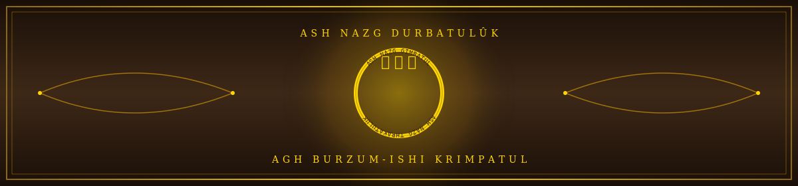
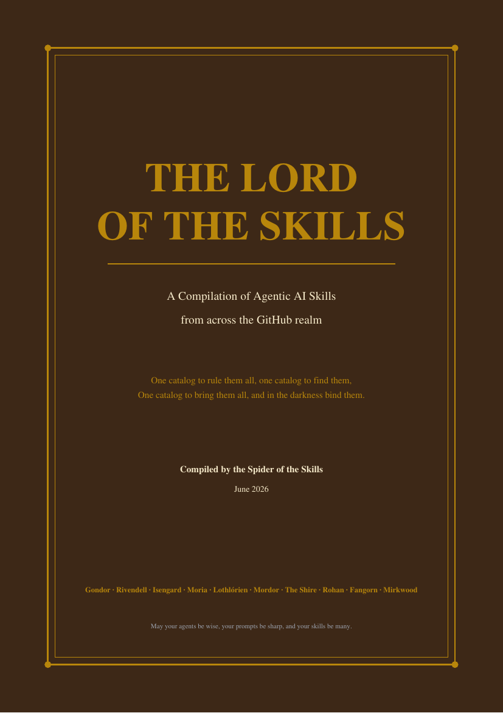
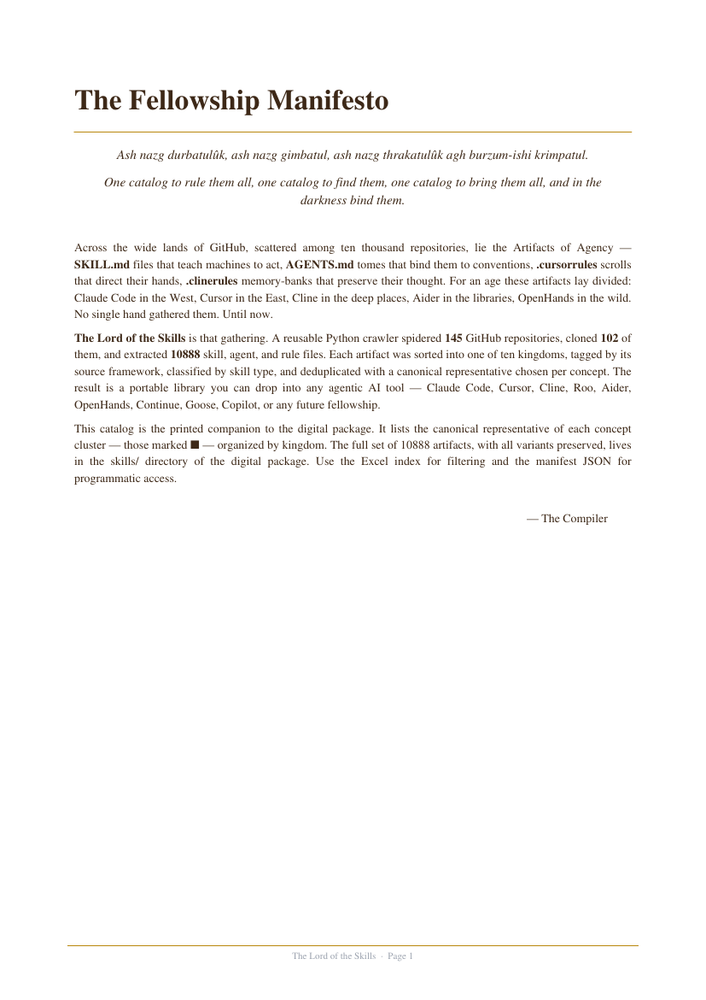
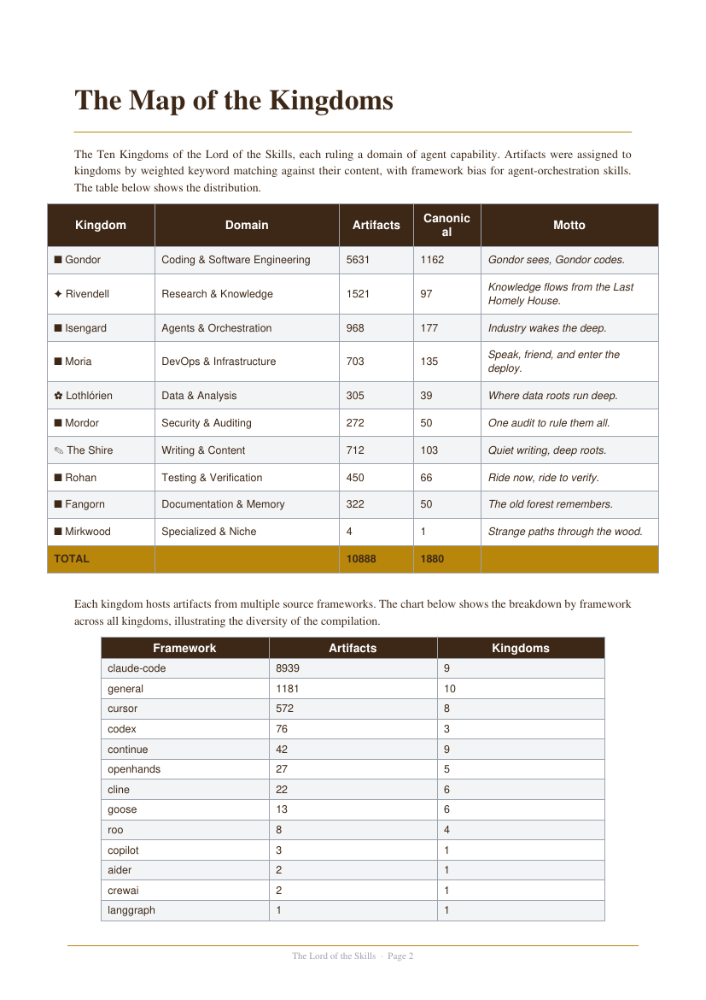
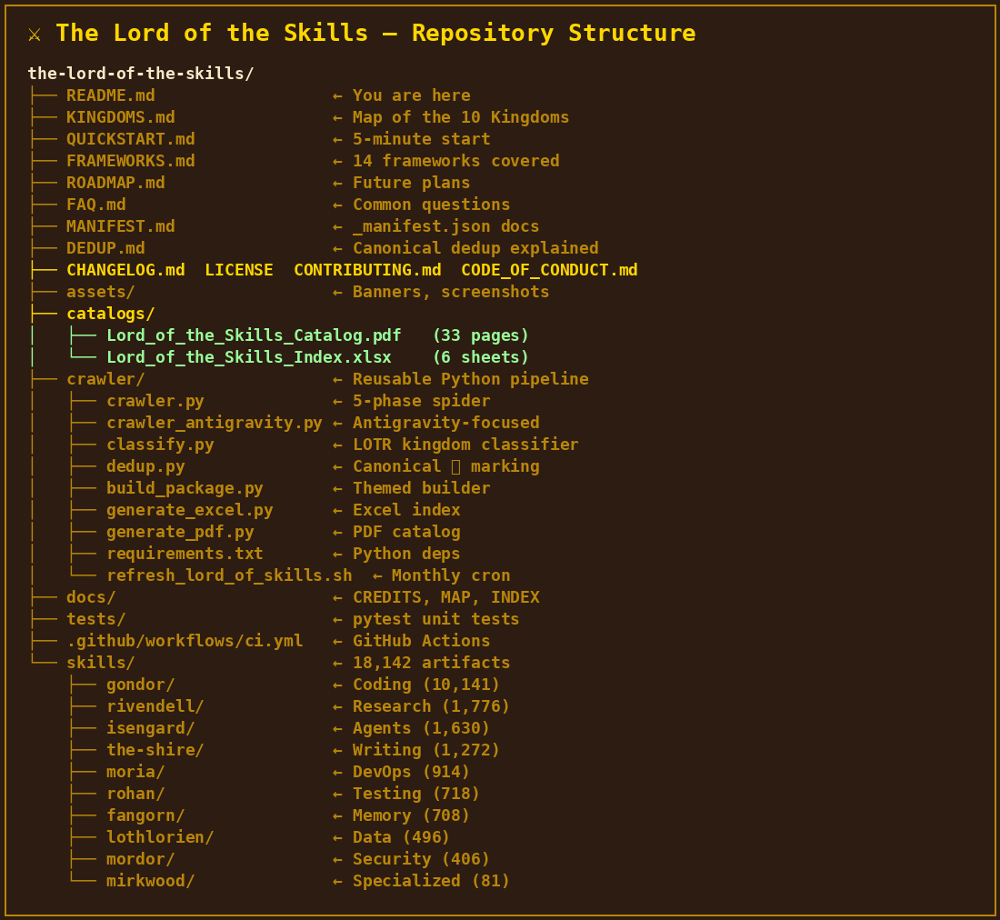

<div align="center">



# ⚔ THE LORD OF THE SKILLS ⚔

### *One Catalog to Rule Them All, One Catalog to Find Them, One Catalog to Bring Them All, and in the Darkness Bind Them*

[](https://github.com/Bilal140202/the-lord-of-the-skills/stargazers)
[](https://github.com/Bilal140202/the-lord-of-the-skills/fork)
[](https://github.com/Bilal140202/the-lord-of-the-skills/watchers)
[](LICENSE)
[](https://github.com/Bilal140202/the-lord-of-the-skills/actions)
[](https://github.com/Bilal140202/the-lord-of-the-skills/commits)
[](https://github.com/Bilal140202/the-lord-of-the-skills/graphs/contributors)
[](https://github.com/Bilal140202/the-lord-of-the-skills/issues)
[](https://github.com/Bilal140202/the-lord-of-the-skills)

### 🌟 *A growing, organized collection of AI agent skills — covering 14 frameworks* 🌟

**18,142+ artifacts** · **14 frameworks** · **10 LOTR-themed kingdoms** · **307+ source repos** · **357 canonical ⭐**

</div>

---

## ✨ Spotlight: The Only Catalog Covering Google Antigravity

<div align="center">

**🟪 Google Antigravity** ([antigravity.google](https://antigravity.google)) is Google's new AI-first IDE launched November 2025 alongside Gemini 3 — a heavily modified VS Code fork.

**820 Antigravity-tagged skills** · across all 10 kingdoms · spidered via a dedicated 30-query focused crawler

</div>

While most AI skill catalogs have **zero Antigravity coverage**, this repo has been on it since launch. If you're an Antigravity user, this is your definitive skill library. Browse: `find skills/ -path '*antigravity*' -name '*.md'`

📖 See [`FRAMEWORKS.md`](FRAMEWORKS.md) for the full 14-framework breakdown.

---

## 🤔 Why This Repo?

| | |
|:---|:---|
| 🏆 **Largest collection** | 18,142+ skills from 307+ GitHub repos, covering Claude Code, Cursor, Cline, Roo, Aider, OpenHands, Codex, Continue, Goose, Copilot, AutoGen, CrewAI, LangGraph, **and Google Antigravity** |
| 🎭 **LOTR-themed** | Sorted into 10 kingdoms (⚔ Gondor = Coding, ✦ Rivendell = Research, 👁 Mordor = Security, ⚙ Isengard = Agents, ...) — memorable, fun, and easy to navigate |
| ✨ **Canonical skills** | Deduplicated with **357 ⭐ canonical representatives** — one best version per concept. See [`DEDUP.md`](DEDUP.md) for how it works |
| 🤖 **`lotr` CLI** | One-command installer: `lotr "write unit tests"` — auto-detects your framework, matches intent to kingdom, downloads only the skills you need. See [`cli/README.md`](cli/README.md) |
| 🚀 **Kickoff mode** | `lotr "building a tauri app"` — auto-installs skills across 5+ kingdoms for a new project. Only 10-15 files downloaded, not 18,000 |
| 🤖 **Reusable crawler** | Open-source Python spider — clone it and build your own kingdom. See [`crawler/README.md`](crawler/README.md) |
| 📦 **Drop-in ready** | Copy any kingdom's skills into your agent's `~/.claude/skills/`, `.cursor/rules/`, `.clinerules/`, etc. — works instantly |

---

## 🚀 Quick Start (60 seconds)

### Option A — `lotr` CLI (recommended)

```bash
# Install (once PyPI is published — see PUBLISHING.md)
pip install lotr-skills

# cd into any project that uses an AI agent
cd my-react-project/

# One command does everything:
lotr "write unit tests for the API"
# → detects cursor + typescript + react
# → matches "unit tests" → rohan (testing)
# → downloads 2 canonical skills
# → places in .cursor/rules/ (1 second)

# Project kickoff mode (auto-detected):
lotr "building a tauri app"
# → detects cursor + typescript
# → plans 5 kingdoms (gondor, rohan, moria, fangorn, isengard)
# → downloads 4 canonical skills across all kingdoms
# → places in .cursor/rules/ (1.4 seconds)
```

### Option B — Manual copy

```bash
# 1. Clone
git clone https://github.com/Bilal140202/the-lord-of-the-skills.git
cd the-lord-of-the-skills

# 2. Copy skills into your agent (pick your framework)
cp -r skills/gondor/claude-code/* ~/.claude/skills/           # Claude Code
cp -r skills/gondor/cursor/*     .cursor/rules/               # Cursor
cp -r skills/gondor/cline/*      .clinerules/                 # Cline / Roo
cp skills/gondor/aider/CONVENTIONS.md ./CONVENTIONS.md        # Aider

# 3. Or — canonical ⭐ only (1 best skill per concept)
find skills/ -name 'canonical__*' -exec cp {} ~/.claude/skills/ \;
```

📖 **Full guide:** [`QUICKSTART.md`](QUICKSTART.md) · **CLI docs:** [`cli/README.md`](cli/README.md) · **Browse:** [`KINGDOMS.md`](KINGDOMS.md) · **Frameworks:** [`FRAMEWORKS.md`](FRAMEWORKS.md)

---

## 🖼 Previews

<div align="center">

<table>
<tr>
<td width="50%" align="center"><b>📄 PDF Catalog (33 pages)</b></td>
<td width="50%" align="center"><b>📊 Excel Index (6 sheets)</b></td>
</tr>
<tr>
<td width="50%" align="center"></td>
<td width="50%" align="center"></td>
</tr>
<tr>
<td width="50%" align="center"></td>
<td width="50%" align="center"></td>
</tr>
</table>

</div>

---

## 🗺 The Ten Kingdoms

| | Kingdom | Domain | Artifacts | Canonical |
|:---:|:---|:---|---:|---:|
| ⚔ | [**Gondor**](skills/gondor/README.md) | Coding & Software Engineering | 10,141 | 188 ⭐ |
| ✦ | [**Rivendell**](skills/rivendell/README.md) | Research & Knowledge | 1,776 | 30 ⭐ |
| ⚙ | [**Isengard**](skills/isengard/README.md) | Agents & Orchestration | 1,630 | 19 ⭐ |
| ✎ | [**The Shire**](skills/the-shire/README.md) | Writing & Content | 1,272 | 22 ⭐ |
| ⛏ | [**Moria**](skills/moria/README.md) | DevOps & Infrastructure | 914 | 40 ⭐ |
| 🐴 | [**Rohan**](skills/rohan/README.md) | Testing & Verification | 718 | 20 ⭐ |
| 🌳 | [**Fangorn**](skills/fangorn/README.md) | Documentation & Memory | 708 | 15 ⭐ |
| ✿ | [**Lothlórien**](skills/lothlorien/README.md) | Data & Analysis | 496 | 13 ⭐ |
| 👁 | [**Mordor**](skills/mordor/README.md) | Security & Auditing | 406 | 9 ⭐ |
| 🕸 | [**Mirkwood**](skills/mirkwood/README.md) | Specialized & Niche | 81 | 1 ⭐ |
| | **TOTAL** | | **18,142** | **357 ⭐** |

📖 Full mottos, frameworks, and per-kingdom stats: [`KINGDOMS.md`](KINGDOMS.md)

---

## ⚙ Frameworks Covered (14)

| Framework | Files | Description |
|:---|---:|:---|
| 🟠 **claude-code** | 8,104 | Anthropic's `SKILL.md` format |
| 🟣 **cursor** | 1,400+ | `.cursorrules` / `.cursor/rules/*.mdc` |
| 🟡 **openhands** | 400+ | OpenHands agent files |
| 🟤 **continue** | 200+ | `.continue/` config |
| 🟪 **antigravity** | 820 | **Google Antigravity IDE** (new!) |
| ⚫ **codex** | 500+ | OpenAI Codex `AGENTS.md` |
| 🔵 **cline** | 1,400+ | `.clinerules/` memory banks |
| ⚪ **roo** | 800+ | Roo Code `.roo/rules/` |
| 🟢 **aider** | 600+ | `CONVENTIONS.md` + `.aider*` |
| ⚪ **goose** | 150+ | Block Goose extensions |
| 🔵 **copilot** | 100+ | `.github/copilot-instructions.md` |
| 🟣 **crewai** | 80+ | CrewAI agent configs |
| 🟢 **langgraph** | 60+ | LangGraph agent definitions |
| ⚪ **general** | 2,535+ | Cross-framework / unclassified |

📖 Detailed breakdown: [`FRAMEWORKS.md`](FRAMEWORKS.md)

---

## 📦 What's in This Repo?

```
the-lord-of-the-skills/
├── README.md              ← You are here (short!)
├── QUICKSTART.md          ← 60-second start (CLI + manual)
├── KINGDOMS.md            ← Map of the 10 Kingdoms
├── FRAMEWORKS.md          ← 14-framework breakdown
├── ROADMAP.md             ← Future plans
├── FAQ.md                 ← Common questions
├── MANIFEST.md            ← _manifest.json schema docs
├── DEDUP.md               ← Canonical dedup explained
├── PUBLISHING.md          ← How to publish lotr-skills to PyPI
├── pyproject.toml         ← PyPI package config (lotr-skills)
├── CHANGELOG.md           ← Version history
├── catalogs/              ← PDF + Excel indexes
├── cli/                   ← lotr CLI (install, kickoff, search, ...)
├── crawler/               ← Reusable Python pipeline
├── docs/                  ← Credits, map, full index
├── tests/                 ← pytest unit tests
├── .github/workflows/     ← CI/CD
└── skills/                ← 18,142 artifacts (10 kingdoms)
```

---

## 🕷 Use Our Crawler for Your Own Project

The crawler is fully reusable — clone it and build your own kingdom:

```bash
cd crawler/
pip install -r requirements.txt
python3 crawler.py            # Spider GitHub (5-phase, resumable)
python3 classify.py           # Tag each file with kingdom + skill type
python3 dedup.py              # Cluster + mark canonical ⭐
python3 build_package.py      # Build themed package
python3 generate_excel.py     # Excel index
python3 generate_pdf.py       # PDF catalog
```

📖 Full docs: [`crawler/README.md`](crawler/README.md) · Auto-refresh monthly via `cron`

---

## 🌟 Star Appreciation

<div align="center">

### ⭐ *If this compilation saved you time, give it a star!* ⭐

[](https://star-history.com/#Bilal140202/the-lord-of-the-skills&Date)

**Every star tells the compiler the kingdom was worth building.**

[](https://github.com/Bilal140202/the-lord-of-the-skills/stargazers)

</div>

---

## 🤝 Contributing

The kingdom grows with every contributor. See [`CONTRIBUTING.md`](CONTRIBUTING.md) for:

- 🏰 **Adding a new skill** — submit a PR with a SKILL.md / AGENTS.md / .cursorrules file
- ⚔ **Adding a new kingdom** — propose a new domain in an Issue
- 🕷 **Improving the crawler** — make the spider smarter, broader, faster
- 📚 **Improving docs** — fix typos, add examples, translate

[](https://github.com/Bilal140202/the-lord-of-the-skills/graphs/contributors)

---

## 📜 Changelog (latest)

### [v1.6.0] — 2026-06-29 — *The Kickoff + PyPI*
- 🚀 New `lotr kickoff` mode — multi-kingdom project setup (`lotr "building a tauri app"`)
- 🧠 Smart auto-detection: CLI figures out install vs kickoff from your phrasing
- 📦 PyPI package ready: `pip install lotr-skills` (see [`PUBLISHING.md`](PUBLISHING.md))
- 🧪 21 new tests (194 total, all passing)

### [v1.5.0] — 2026-06-29 — *The One Command*
- 🚀 New `lotr` CLI — smart skills installer (`lotr "write unit tests"`)
- 📊 `skills/index.json` — 16,760 skills indexed, instant lookup
- 🎨 Per-framework placement (10 frameworks)
- 🧪 43 new CLI tests

### [v1.4.0] — 2026-06-22 — *The Trustworthy Kingdom*
- 🔒 Added SECURITY.md, 4 GitHub Releases, 3 seeded Discussions
- 🏷 Updated description + topics (added mcp, prompt-engineering, antigravity)
- ✨ Antigravity spotlight, softened "LARGEST" claim

### [v1.3.0] — 2026-06-22 — *The Polished Kingdom*
- 🎨 Shortened README (1,000+ → 200 lines), added 10 badges, screenshots, "Why This Repo?" section
- 📚 6 new docs: QUICKSTART, FRAMEWORKS, ROADMAP, FAQ, MANIFEST, DEDUP
- 🛠 Added `requirements.txt` + `pyproject.toml` + GitHub Actions CI/CD + 130 pytest tests
- 🤝 Created 5 starter issues (good-first-issue) + 8 labels + promotion post templates

### [v1.2.0] — 2026-06-19 — *The Antigravity Frontier*
- ✨ Added Google Antigravity as the 14th framework (820 files tagged)
- 🕷 Built `crawler_antigravity.py` with 30 targeted search queries
- 📊 Discovered 689 antigravity-related repos, cloned 307, extracted 11,697 files
- 📈 Total artifacts: 10,888 → **18,142** (+66%)

### [v1.1.0] — 2026-06-19 — *The Kingdoms Take Shape*
- 🏰 Restructured: per-kingdom `README.md` for all 10 kingdoms
- 🗺 Added top-level `KINGDOMS.md` index
- 🐛 Renamed 508 files to URL/git-safe names (⭐ → `canonical__`)

### [v1.0.0] — 2026-06-19 — *The Fellowship Forms*
- 🎉 Initial compilation: 10,888 artifacts from 102 source repos across 13 frameworks

📖 Full history: [`CHANGELOG.md`](CHANGELOG.md) · Future plans: [`ROADMAP.md`](ROADMAP.md)

---

## ⚖ Licensing

- **Compilation scripts** (crawler/, build_package.py, etc.): **MIT** — see [LICENSE](LICENSE)
- **Skill artifacts** (skills/): Each retains its **original upstream license** — see [docs/CREDITS.md](docs/CREDITS.md)

If you are an upstream maintainer and wish to have your skills removed, please [open an issue](https://github.com/Bilal140202/the-lord-of-the-skills/issues/new).

---

## 🙏 Credits

This compilation would not exist without the **307+ source repositories**. See [`docs/CREDITS.md`](docs/CREDITS.md) for the full list.

Special thanks to: `anthropics/anthropic-cookbook`, `hesreallyhim/awesome-claude-code`, `cline/cline`, `Aider-AI/aider`, `All-Hands-AI/OpenHands`, `continuedev/continue`, `block/goose`, `microsoft/autogen`, `crewAIInc/crewAI`, `langchain-ai/langgraph`, `modelcontextprotocol/servers`, `sickn33/antigravity-awesome-skills`, and 295+ more.

---

<div align="center">

### 🌟 *May your agents be wise, your prompts be sharp, and your skills be many.* 🌟

**Built with ⚔ by [Ansari Mohammad Bilal](https://github.com/Bilal140202)**

[⭐ Star this repo](https://github.com/Bilal140202/the-lord-of-the-skills/stargazers) ·
[🍴 Fork it](https://github.com/Bilal140202/the-lord-of-the-skills/fork) ·
[💬 Open an issue](https://github.com/Bilal140202/the-lord-of-the-skills/issues/new) ·
[📖 Read the docs](KINGDOMS.md)

</div>
