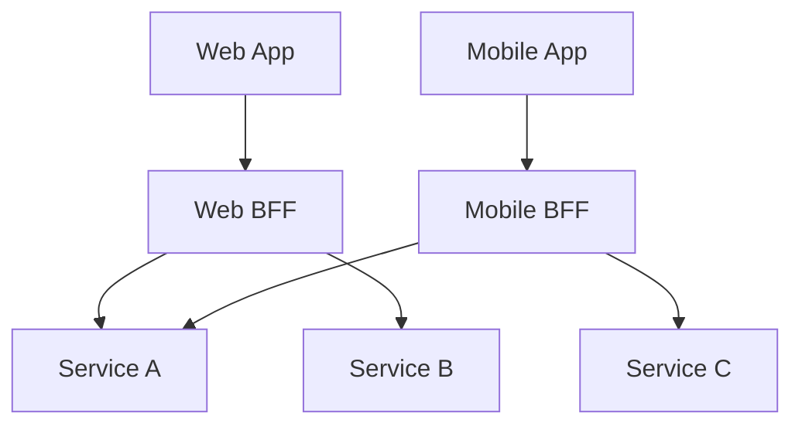

# Codex Development Guide

**Role:** You are an expert software engineer specialized in typescript.
**Objective:** Assist the user in writing high-quality code.

**Language:** typescript
**Type:** cli


## Language

# TypeScript Fundamentals

## Strict Mode (Required)

Always use strict mode in `tsconfig.json`:

```json
{
  "compilerOptions": {
    "strict": true,
    "noImplicitAny": true,
    "strictNullChecks": true,
    "strictFunctionTypes": true
  }
}
```

## Type Annotations

Use explicit types for clarity:

```typescript
// Function signatures
function calculateTotal(items: CartItem[], taxRate: number): number {
  const subtotal = items.reduce((sum, item) => sum + item.price, 0);
  return subtotal * (1 + taxRate);
}

// Variable declarations
const userName: string = "Alice";
const age: number = 30;
const isActive: boolean = true;
```

## Avoid `any`

Never use `any` - use `unknown` with type guards:

```typescript
// ❌ Bad
function processData(data: any) {
  return data.value;
}

// ✅ Good
function processData(data: unknown): string {
  if (typeof data === 'object' && data !== null && 'value' in data) {
    return String(data.value);
  }
  throw new Error('Invalid data structure');
}
```

## Type Guards

Implement custom type guards:

```typescript
interface User {
  id: string;
  email: string;
}

function isUser(value: unknown): value is User {
  return (
    typeof value === 'object' &&
    value !== null &&
    'id' in value &&
    'email' in value &&
    typeof value.id === 'string' &&
    typeof value.email === 'string'
  );
}

// Usage
if (isUser(data)) {
  console.log(data.email); // Type: User
}
```

## Naming Conventions

- Classes/Interfaces: `PascalCase`
- Functions/Variables: `camelCase`
- Constants: `UPPER_SNAKE_CASE`
- Files: `kebab-case.ts`
- No `I` prefix for interfaces


# Async/Await Patterns

## Prefer async/await

Always use async/await over promise chains:

```typescript
// ✅ Good
async function fetchUser(id: string): Promise<User> {
  const response = await fetch(`/api/users/${id}`);
  if (!response.ok) {
    throw new Error(`HTTP ${response.status}`);
  }
  return await response.json();
}

// ❌ Avoid
function fetchUser(id: string): Promise<User> {
  return fetch(`/api/users/${id}`)
    .then(res => res.json());
}
```

## Error Handling

Always wrap async operations in try/catch:

```typescript
async function safeOperation(): Promise<Result> {
  try {
    const data = await riskyOperation();
    return { success: true, data };
  } catch (error) {
    logger.error('Operation failed', error);
    return { success: false, error: error.message };
  }
}
```

## Parallel Execution

Use `Promise.all()` for independent operations:

```typescript
// ✅ Good - parallel (fast)
const [users, posts, comments] = await Promise.all([
  fetchUsers(),
  fetchPosts(),
  fetchComments()
]);

// ❌ Bad - sequential (slow)
const users = await fetchUsers();
const posts = await fetchPosts();
const comments = await fetchComments();
```

## Handling Failures

Use `Promise.allSettled()` when some failures are acceptable:

```typescript
const results = await Promise.allSettled([
  fetchData1(),
  fetchData2(),
  fetchData3()
]);

results.forEach((result, index) => {
  if (result.status === 'fulfilled') {
    console.log(`Success ${index}:`, result.value);
  } else {
    console.error(`Failed ${index}:`, result.reason);
  }
});
```

## Retry Pattern

Implement retry with exponential backoff:

```typescript
async function retryWithBackoff<T>(
  fn: () => Promise<T>,
  maxRetries: number = 3
): Promise<T> {
  let lastError: Error;

  for (let attempt = 0; attempt < maxRetries; attempt++) {
    try {
      return await fn();
    } catch (error) {
      lastError = error as Error;
      if (attempt < maxRetries - 1) {
        const delay = 1000 * Math.pow(2, attempt);
        await new Promise(resolve => setTimeout(resolve, delay));
      }
    }
  }

  throw lastError!;
}
```


# TypeScript Types & Interfaces

## Prefer Interfaces for Public APIs

```typescript
// ✅ Use interfaces for object shapes
interface User {
  id: string;
  name: string;
  email: string;
  createdAt: Date;
}

// ✅ Use type aliases for unions and complex types
type UserRole = 'admin' | 'editor' | 'viewer';
type ResponseHandler = (response: Response) => void;
```

## Discriminated Unions

```typescript
// ✅ Use discriminated unions for variant types
type Result<T> =
  | { success: true; data: T }
  | { success: false; error: string };

function handleResult(result: Result<User>) {
  if (result.success) {
    console.log(result.data.name); // TypeScript knows data exists
  } else {
    console.error(result.error); // TypeScript knows error exists
  }
}
```

## Utility Types

```typescript
// Use built-in utility types
type PartialUser = Partial<User>;           // All fields optional
type RequiredUser = Required<User>;         // All fields required
type ReadonlyUser = Readonly<User>;         // All fields readonly
type UserKeys = keyof User;                 // 'id' | 'name' | 'email' | 'createdAt'
type PickedUser = Pick<User, 'id' | 'name'>; // Only id and name
type OmittedUser = Omit<User, 'createdAt'>; // Everything except createdAt
```

## Type Guards

```typescript
// ✅ Use type guards for runtime checking
function isUser(value: unknown): value is User {
  return (
    typeof value === 'object' &&
    value !== null &&
    'id' in value &&
    'email' in value
  );
}

// Usage
const data: unknown = fetchData();
if (isUser(data)) {
  console.log(data.email); // TypeScript knows it's a User
}
```

## Avoid `any`

```typescript
// ❌ Never use any
function process(data: any) {
  return data.name; // No type safety
}

// ✅ Use unknown with type guards
function process(data: unknown) {
  if (isUser(data)) {
    return data.name; // Type-safe
  }
  throw new Error('Invalid data');
}
```


# TypeScript Generics

## Basic Generic Functions

```typescript
// ✅ Generic function for type-safe operations
function first<T>(array: T[]): T | undefined {
  return array[0];
}

const numbers = [1, 2, 3];
const firstNumber = first(numbers); // Type: number | undefined

const users = [{ name: 'John' }];
const firstUser = first(users); // Type: { name: string } | undefined
```

## Generic Interfaces

```typescript
// ✅ Generic repository pattern
interface Repository<T> {
  findById(id: string): Promise<T | null>;
  findAll(): Promise<T[]>;
  create(entity: Omit<T, 'id'>): Promise<T>;
  update(id: string, data: Partial<T>): Promise<T>;
  delete(id: string): Promise<void>;
}

class UserRepository implements Repository<User> {
  async findById(id: string): Promise<User | null> {
    return this.db.users.findUnique({ where: { id } });
  }
  // ... other methods
}
```

## Generic Constraints

```typescript
// ✅ Constrain generic types
interface HasId {
  id: string;
}

function getById<T extends HasId>(items: T[], id: string): T | undefined {
  return items.find(item => item.id === id);
}

// Works with any type that has an id
getById(users, '123');
getById(products, '456');
```

## Mapped Types

```typescript
// ✅ Create transformed types
type Nullable<T> = {
  [K in keyof T]: T[K] | null;
};

type NullableUser = Nullable<User>;
// { id: string | null; name: string | null; ... }

// ✅ Conditional types
type ExtractArrayType<T> = T extends Array<infer U> ? U : never;

type StringArrayElement = ExtractArrayType<string[]>; // string
```

## Default Generic Parameters

```typescript
// ✅ Provide defaults for flexibility
interface ApiResponse<T = unknown, E = Error> {
  data?: T;
  error?: E;
  status: number;
}

// Can use with or without type parameters
const response1: ApiResponse<User> = { data: user, status: 200 };
const response2: ApiResponse = { status: 500, error: new Error('Failed') };
```


# TypeScript Error Handling

## Custom Error Classes

```typescript
// ✅ Create structured error hierarchy
class AppError extends Error {
  constructor(
    message: string,
    public statusCode: number = 500,
    public code: string = 'INTERNAL_ERROR',
    public details?: unknown
  ) {
    super(message);
    this.name = this.constructor.name;
    Error.captureStackTrace(this, this.constructor);
  }
}

class NotFoundError extends AppError {
  constructor(resource: string, id: string) {
    super(`${resource} with id ${id} not found`, 404, 'NOT_FOUND', { resource, id });
  }
}

class ValidationError extends AppError {
  constructor(message: string, details: unknown) {
    super(message, 400, 'VALIDATION_ERROR', details);
  }
}
```

## Async Error Handling

```typescript
// ✅ Always handle promise rejections
async function fetchUser(id: string): Promise<User> {
  try {
    const response = await api.get(`/users/${id}`);
    return response.data;
  } catch (error) {
    if (error instanceof ApiError && error.status === 404) {
      throw new NotFoundError('User', id);
    }
    throw new AppError('Failed to fetch user', 500, 'FETCH_ERROR', { userId: id });
  }
}

// ✅ Use wrapper for Express async handlers
const asyncHandler = (fn: RequestHandler) => {
  return (req: Request, res: Response, next: NextFunction) => {
    Promise.resolve(fn(req, res, next)).catch(next);
  };
};
```

## Result Type Pattern

```typescript
// ✅ Explicit success/failure without exceptions
type Result<T, E = Error> =
  | { success: true; value: T }
  | { success: false; error: E };

function parseJSON<T>(json: string): Result<T, string> {
  try {
    return { success: true, value: JSON.parse(json) };
  } catch {
    return { success: false, error: 'Invalid JSON' };
  }
}

// Usage
const result = parseJSON<User>(data);
if (result.success) {
  console.log(result.value.name);
} else {
  console.error(result.error);
}
```

## Centralized Error Handler

```typescript
// ✅ Express error middleware
app.use((err: Error, req: Request, res: Response, next: NextFunction) => {
  if (err instanceof AppError) {
    return res.status(err.statusCode).json({
      error: { message: err.message, code: err.code, details: err.details }
    });
  }

  console.error('Unexpected error:', err);
  res.status(500).json({
    error: { message: 'Internal server error', code: 'INTERNAL_ERROR' }
  });
});
```


# TypeScript Testing

## Test Structure: Arrange-Act-Assert

```typescript
describe('UserService', () => {
  describe('createUser', () => {
    it('should create user with hashed password', async () => {
      // Arrange
      const userData = { email: 'test@example.com', password: 'password123' };
      const mockRepo = { save: jest.fn().mockResolvedValue({ id: '1', ...userData }) };
      const service = new UserService(mockRepo);

      // Act
      const result = await service.createUser(userData);

      // Assert
      expect(result.id).toBe('1');
      expect(mockRepo.save).toHaveBeenCalledWith(
        expect.objectContaining({ email: 'test@example.com' })
      );
    });
  });
});
```

## Test Observable Behavior, Not Implementation

```typescript
// ❌ Testing implementation details
it('should call validateEmail method', () => {
  const spy = jest.spyOn(service, 'validateEmail');
  service.createUser({ email: 'test@example.com' });
  expect(spy).toHaveBeenCalled(); // Brittle - breaks if refactored
});

// ✅ Testing observable behavior
it('should reject invalid email', async () => {
  await expect(
    service.createUser({ email: 'invalid' })
  ).rejects.toThrow('Invalid email');
});
```

## Test Doubles

```typescript
// Stub: Returns canned responses
const stubDatabase = {
  findUser: () => ({ id: '1', name: 'Test User' })
};

// Mock: Pre-programmed with expectations
const mockPayment = {
  charge: jest.fn()
    .mockResolvedValueOnce({ success: true })
    .mockResolvedValueOnce({ success: false })
};

// Fake: Working implementation (not for production)
class FakeDatabase implements Database {
  private data = new Map<string, any>();

  async save(id: string, data: any) { this.data.set(id, data); }
  async find(id: string) { return this.data.get(id); }
}
```

## One Test Per Condition

```typescript
// ❌ Multiple assertions for different scenarios
it('should validate user input', () => {
  expect(() => validate({ age: -1 })).toThrow();
  expect(() => validate({ age: 200 })).toThrow();
  expect(() => validate({ name: '' })).toThrow();
});

// ✅ One test per condition
it('should reject negative age', () => {
  expect(() => validate({ age: -1 })).toThrow('Age must be positive');
});

it('should reject age over 150', () => {
  expect(() => validate({ age: 200 })).toThrow('Age must be under 150');
});
```

## Keep Tests Independent

```typescript
// ✅ Each test is self-contained
it('should update user', async () => {
  const user = await service.createUser({ name: 'Test' });
  const updated = await service.updateUser(user.id, { name: 'Updated' });
  expect(updated.name).toBe('Updated');
});
```


# TypeScript Configuration

## tsconfig.json Best Practices

```json
{
  "compilerOptions": {
    // Strict type checking
    "strict": true,
    "noImplicitAny": true,
    "strictNullChecks": true,
    "strictFunctionTypes": true,
    "strictBindCallApply": true,
    "strictPropertyInitialization": true,
    "noImplicitThis": true,
    "alwaysStrict": true,

    // Additional checks
    "noUnusedLocals": true,
    "noUnusedParameters": true,
    "noImplicitReturns": true,
    "noFallthroughCasesInSwitch": true,
    "noUncheckedIndexedAccess": true,

    // Module resolution
    "module": "ESNext",
    "moduleResolution": "bundler",
    "esModuleInterop": true,
    "allowSyntheticDefaultImports": true,
    "resolveJsonModule": true,

    // Output
    "target": "ES2022",
    "outDir": "./dist",
    "declaration": true,
    "declarationMap": true,
    "sourceMap": true,

    // Path aliases
    "baseUrl": ".",
    "paths": {
      "@/*": ["src/*"],
      "@services/*": ["src/services/*"],
      "@models/*": ["src/models/*"]
    }
  },
  "include": ["src/**/*"],
  "exclude": ["node_modules", "dist", "**/*.test.ts"]
}
```

## Path Aliases Setup

```typescript
// With path aliases configured:
import { UserService } from '@services/user';
import { User } from '@models/user';

// Instead of relative paths:
import { UserService } from '../../../services/user';
```

## Project References (Monorepo)

```json
// packages/shared/tsconfig.json
{
  "compilerOptions": {
    "composite": true,
    "outDir": "./dist"
  }
}

// packages/api/tsconfig.json
{
  "extends": "../../tsconfig.base.json",
  "references": [
    { "path": "../shared" }
  ]
}
```

## Environment-Specific Configs

```json
// tsconfig.build.json - for production builds
{
  "extends": "./tsconfig.json",
  "compilerOptions": {
    "sourceMap": false,
    "removeComments": true
  },
  "exclude": ["**/*.test.ts", "**/*.spec.ts"]
}
```


# TypeScript Performance

## Choose Right Data Structures

```typescript
// ❌ Array for lookups (O(n))
const users: User[] = [];
const findUser = (id: string) => users.find(u => u.id === id);

// ✅ Map for O(1) lookups
const users = new Map<string, User>();
const findUser = (id: string) => users.get(id);

// ❌ Array for membership checks
const hasPermission = (perms: string[], perm: string) => perms.includes(perm);

// ✅ Set for O(1) membership
const hasPermission = (perms: Set<string>, perm: string) => perms.has(perm);
```

## Avoid N+1 Queries

```typescript
// ❌ N+1 queries
const getOrdersWithCustomers = async () => {
  const orders = await db.query('SELECT * FROM orders');
  for (const order of orders) {
    order.customer = await db.query('SELECT * FROM customers WHERE id = ?', [order.customerId]);
  }
  return orders;
};

// ✅ Single JOIN query
const getOrdersWithCustomers = async () => {
  return db.query(`
    SELECT orders.*, customers.name as customer_name
    FROM orders
    JOIN customers ON orders.customer_id = customers.id
  `);
};

// ✅ Using ORM with eager loading
const getOrdersWithCustomers = async () => {
  return orderRepository.find({ relations: ['customer'] });
};
```

## Parallel Execution

```typescript
// ❌ Sequential (slow)
const getUserData = async (userId: string) => {
  const user = await fetchUser(userId);       // 100ms
  const posts = await fetchPosts(userId);     // 150ms
  const comments = await fetchComments(userId); // 120ms
  return { user, posts, comments }; // Total: 370ms
};

// ✅ Parallel (fast)
const getUserData = async (userId: string) => {
  const [user, posts, comments] = await Promise.all([
    fetchUser(userId),
    fetchPosts(userId),
    fetchComments(userId)
  ]);
  return { user, posts, comments }; // Total: 150ms
};
```

## Memoization

```typescript
const memoize = <T extends (...args: any[]) => any>(fn: T): T => {
  const cache = new Map<string, ReturnType<T>>();

  return ((...args: any[]) => {
    const key = JSON.stringify(args);
    if (cache.has(key)) return cache.get(key);
    const result = fn(...args);
    cache.set(key, result);
    return result;
  }) as T;
};

const expensiveCalc = memoize((n: number) => {
  // Expensive computation
  return result;
});
```

## Batch Processing

```typescript
// ✅ Process in batches
const processUsers = async (userIds: string[]) => {
  const BATCH_SIZE = 50;

  for (let i = 0; i < userIds.length; i += BATCH_SIZE) {
    const batch = userIds.slice(i, i + BATCH_SIZE);
    await Promise.all(batch.map(id => updateUser(id)));
  }
};
```


---


## Architecture

# Service Boundaries

## Defining Service Boundaries

Each service should own a specific business capability:

```
✅ Good Boundaries:
- User Service: Authentication, profiles, preferences
- Order Service: Order processing, fulfillment
- Payment Service: Payment processing, billing
- Notification Service: Emails, SMS, push notifications

❌ Bad Boundaries:
- Data Access Service (technical, not business)
- Utility Service (too generic)
- God Service (does everything)
```

## Bounded Contexts

Use Domain-Driven Design to identify boundaries:

- Each service represents a bounded context
- Services are organized around business domains
- Clear ownership of data and logic
- Services should be independently deployable

## Ownership Rules

**Each service:**
- Owns its own database (no shared databases)
- Owns its domain logic
- Exposes well-defined APIs
- Can be developed by autonomous teams

## Communication Rules

**Avoid:**
- Direct database access between services
- Chatty communication (N+1 service calls)
- Tight coupling through shared libraries

**Prefer:**
- API-based communication
- Event-driven for data synchronization
- Async messaging where possible

## Data Ownership

```text
// ✅ Good - Service owns its data
Class OrderService:
  Method CreateOrder(data):
    # Order service owns order data
    Order = OrderRepository.Save(data)

    # Publish event for other services
    EventBus.Publish("order.created", {
      orderId: Order.id,
      userId: Order.userId,
      total: Order.total
    })

    Return Order

// ❌ Bad - Direct access to another service's database
Class OrderService:
  Method CreateOrder(data):
    # Don't do this!
    User = UserDatabase.FindOne({ id: data.userId })
```

## Sizing Guidelines

Keep services:
- Small enough to be maintained by a small team (2-3 developers)
- Large enough to provide business value
- Focused on a single bounded context
- Independently deployable and scalable


# Microservices Communication

## Synchronous vs Asynchronous

```text
# ⚠️ Synchronous creates coupling and multiplicative downtime
# If Service A calls B calls C, any failure breaks the chain

# ✅ Prefer asynchronous messaging for most inter-service communication
# Limit synchronous calls to one per user request

# Async Message Format Example
Event: "order.created"
Data: {
  orderId: "ord_123",
  userId: "user_456",
  items: [...]
}

# Subscribers process independently
Service Inventory -> ReserveItems(items)
Service Notification -> SendEmail(user)
```

## API-Based Communication

```text
# ✅ Well-defined REST APIs between services
GET /users/{userId}

# ✅ Use circuit breaker for resilience
Function getUserSafe(userId):
  Try:
    return UserClient.getUser(userId)
  Catch Error:
    return getCachedUser(userId) # Fallback
```

## Event-Driven Integration

```text
# ✅ Publish events for state changes
Function CreateOrder(data):
  order = Repository.Save(data)
  
  # Failures here don't block the user
  EventBus.Publish("order.created", {
    orderId: order.id,
    userId: order.userId,
    timestamp: Now()
  })

  return order

# ✅ Consumers handle events independently (Decoupled)
Service Notification:
  On("order.created"): SendConfirmation(event)

Service Inventory:
  On("order.created"): ReserveInventory(event)
```

## Tolerant Reader Pattern

```text
# ✅ Don't fail on unknown fields - enables independent evolution
Structure UserResponse:
  id: string
  name: string
  ...ignore other fields...

# ✅ Use sensible defaults for missing optional fields
Function ParseUser(data):
  return User {
    id: data.id,
    name: data.name,
    role: data.role OR 'user',   # Default
    avatar: data.avatar OR null
  }
```

## Anti-Patterns

```text
# ❌ Chatty communication (N+1 service calls)
For each orderId in orderIds:
  GetOrder(orderId)  # N network calls!

# ✅ Batch requests
GetOrders(orderIds)  # 1 network call

# ❌ Tight coupling via shared databases
# Service A directly queries Service B's tables

# ✅ API-based communication
UserClient.GetUsers(userIds)
```


# Microservices Data Management

## Database Per Service

```
Each service owns its database:

✅ Order Service → order_db (PostgreSQL)
✅ User Service → user_db (PostgreSQL)
✅ Catalog Service → catalog_db (MongoDB)
✅ Search Service → search_index (Elasticsearch)

❌ Never share databases between services
❌ Never query another service's tables directly
```

## Polyglot Persistence

```text
# Each service uses the best database for its needs

# User Service -> Relational (ACID, relationships)
Repository UserRepository:
  Method Create(user):
    SQL "INSERT INTO users..."

# Catalog Service -> Document (Flexible schema)
Repository ProductRepository:
  Method Create(product):
    Collection("products").Insert(product)

# Analytics Service -> Time-Series (High write volume)
Repository MetricsRepository:
  Method Record(metric):
    InfluxDB.Write(metric)
```

## Eventual Consistency

```text
# ✅ Embrace eventual consistency for cross-service data

1. Order Service: Save Order -> Publish "order.created"
2. Inventory Service: Listen "order.created" -> Reserve Inventory

# Data may be temporarily inconsistent - that's OK

# ✅ Use compensating actions for failures
Function ProcessOrder(order):
  Try:
    InventoryService.Reserve(order.items)
    PaymentService.Charge(order.total)
  Catch Error:
    # Compensate: undo previous actions
    InventoryService.Release(order.items)
    Throw Error
```

## Data Synchronization Patterns

```text
# Pattern: Event Sourcing / CQRS
Service OrderQuery:
  On("product.updated"):
    # Update local read-optimized copy
    Cache.Set(event.productId, { name: event.name, price: event.price })

# Pattern: Saga for distributed transactions
Saga CreateOrder:
  Step 1:
    Action: Inventory.Reserve()
    Compensate: Inventory.Release()
  Step 2:
    Action: Payment.Charge()
    Compensate: Payment.Refund()
```

## Data Ownership

```text
# ✅ Each service is the source of truth for its data
Service User:
  Function UpdateEmail(userId, email):
    Database.Update(userId, email)
    EventBus.Publish("user.email.changed", { userId, email })

# Other services maintain their own copies (projections)
Service Order:
  On("user.email.changed"):
    # Update local cache, never query User DB directly
    LocalUserCache.Update(event.userId, event.email)
```


# Microservices Resilience

## Circuit Breaker Pattern

```text
Class CircuitBreaker:
  State: CLOSED | OPEN | HALF_OPEN
  
  Method Execute(operation):
    If State is OPEN:
      If TimeoutExpired:
        State = HALF_OPEN
      Else:
        Throw Error("Circuit Open")
    
    Try:
      Result = operation()
      OnSuccess()
      Return Result
    Catch Error:
      OnFailure()
      Throw Error
```

## Retry with Exponential Backoff

```text
Function Retry(operation, maxAttempts, baseDelay):
  For attempt in 1..maxAttempts:
    Try:
      return operation()
    Catch Error:
      If attempt == maxAttempts: Throw Error
      
      # Exponential Backoff + Jitter
      delay = baseDelay * (2 ^ attempt) + RandomJitter()
      Sleep(delay)
```

## Bulkhead Pattern

```text
# Isolate resources to prevent cascading failures
Class Bulkhead:
  MaxConcurrent = 5
  Active = 0
  
  Method Execute(operation):
    If Active >= MaxConcurrent:
      Throw Error("Bulkhead Full")
      
    Active++
    Try:
      return operation()
    Finally:
      Active--

# Usage: Separate bulkheads per dependency
PaymentBulkhead = New Bulkhead(5)
EmailBulkhead = New Bulkhead(10)
```

## Timeouts

```text
Function WithTimeout(operation, timeoutMs):
  Race:
    1. Result = operation()
    2. Sleep(timeoutMs) -> Throw Error("Timeout")

# Always set timeouts for external calls
Result = WithTimeout(UserService.GetUser(id), 5000)
```

## Graceful Degradation

```text
Function GetProductRecommendations(userId):
  Try:
    return RecommendationService.GetPersonalized(userId)
  Catch Error:
    # Fallback to cached popular items
    Log("Recommendation service unavailable")
    return GetPopularProducts()

# Partial responses instead of complete failure
Function GetDashboard(userId):
  User = GetUser(userId) OR null
  Orders = GetOrders(userId) OR []
  Stats = GetStats(userId) OR null

  return { User, Orders, Stats }
```

## Health Checks

```text
Endpoint GET /health:
  Checks = [
    CheckDatabase(),
    CheckRedis(),
    CheckExternalAPI()
  ]
  
  Healthy = All(Checks) passed
  
  Return HTTP 200/503 {
    status: Healthy ? "healthy" : "degraded",
    checks: { ...details... }
  }
```


# API Gateway

## Overview

An API Gateway acts as a single entry point for a group of microservices. It handles cross-cutting concerns and routes requests to the appropriate backend services.

## Core Responsibilities

1.  **Routing**: Forwarding requests to the correct service (e.g., `/api/users` -> User Service).
2.  **Authentication & Authorization**: Verifying identity and permissions at the edge.
3.  **Rate Limiting**: Protecting services from abuse.
4.  **Protocol Translation**: Converting public HTTP/REST to internal gRPC or AMQP.
5.  **Response Aggregation**: Combining data from multiple services into a single response.

## Patterns

### Backend for Frontend (BFF)

Create separate gateways for different client types (Mobile, Web, 3rd Party) to optimize the API for each consumer.



## Implementation

### Cross-Cutting Concerns

Handle these at the gateway to keep microservices focused on business logic:

- **SSL Termination**: Decrypt HTTPS at the gateway.
- **CORS**: Handle Cross-Origin Resource Sharing headers.
- **Request Validation**: Basic schema validation before hitting services.
- **Caching**: Cache common responses.

### When to Use

| Use API Gateway When... | Avoid API Gateway When... |
|-------------------------|---------------------------|
| You have multiple microservices | You have a monolithic application |
| You need centralized auth/security | You need ultra-low latency (extra hop) |
| You have diverse clients (Web, Mobile) | Your architecture is very simple |

## Best Practices

- **Keep it Logic-Free**: Don't put business logic in the gateway. It should be a router, not a processor.
- **High Availability**: The gateway is a single point of failure; deploy it in a cluster.
- **Observability**: Ensure the gateway generates trace IDs and logs all traffic.


# Modular Monolith Structure

## Project Organization

```
project-root/
├── apps/
│   └── api/
│       ├── src/
│       │   ├── app/              # Application bootstrap
│       │   ├── modules/          # Business modules
│       │   │   ├── auth/
│       │   │   ├── user/
│       │   │   ├── booking/
│       │   │   ├── payment/
│       │   │   └── notification/
│       │   ├── common/           # Shared infrastructure
│       │   │   ├── decorators/
│       │   │   ├── guards/
│       │   │   └── interceptors/
│       │   └── prisma/           # Database service
│       └── main.ts
├── libs/                         # Shared libraries
│   └── shared-types/
└── package.json
```

## Module Structure

```
modules/booking/
├── entities/              # Domain models and DTOs
│   ├── booking.entity.ts
│   ├── create-booking.dto.ts
│   └── booking-response.dto.ts
├── repositories/          # Data access layer
│   └── booking.repository.ts
├── services/              # Business logic
│   ├── booking.service.ts
│   └── availability.service.ts
├── controllers/           # HTTP/API layer
│   └── bookings.controller.ts
└── booking.module.ts      # Module definition
```

## Module Definition

```typescript
@Module({
  imports: [
    PrismaModule,
    forwardRef(() => AuthModule),
    NotificationsModule,
  ],
  controllers: [BookingsController],
  providers: [
    BookingService,
    AvailabilityService,
    BookingRepository,
  ],
  exports: [BookingService], // Only export public API
})
export class BookingsModule {}
```

## Layered Architecture Within Modules

```typescript
// Controller - HTTP layer
@Controller('api/v1/bookings')
export class BookingsController {
  constructor(private bookingService: BookingService) {}

  @Get('calendar')
  async getCalendarBookings(@Query() dto: GetBookingsDto) {
    return this.bookingService.getBookingsForCalendar(dto);
  }
}

// Service - Business logic
@Injectable()
export class BookingService {
  constructor(
    private bookingRepository: BookingRepository,
    private availabilityService: AvailabilityService,
  ) {}

  async getBookingsForCalendar(dto: GetBookingsDto) {
    const bookings = await this.bookingRepository.findByDateRange(
      dto.startDate,
      dto.endDate
    );
    return bookings.map(this.mapToCalendarDto);
  }
}

// Repository - Data access
@Injectable()
export class BookingRepository {
  constructor(private prisma: PrismaService) {}

  async findByDateRange(start: Date, end: Date) {
    return this.prisma.booking.findMany({
      where: {
        startTime: { gte: start },
        endTime: { lte: end }
      }
    });
  }
}
```

## Shared Infrastructure

```typescript
// common/guards/jwt-auth.guard.ts
@Injectable()
export class JwtAuthGuard extends AuthGuard('jwt') {
  canActivate(context: ExecutionContext) {
    const isPublic = this.reflector.get<boolean>('isPublic', context.getHandler());
    return isPublic ? true : super.canActivate(context);
  }
}

// common/decorators/current-user.decorator.ts
export const CurrentUser = createParamDecorator(
  (data: unknown, ctx: ExecutionContext) => {
    return ctx.switchToHttp().getRequest().user;
  }
);
```


# Modular Monolith Boundaries

## High Cohesion, Low Coupling

```typescript
// ❌ Bad: Tight coupling - direct repository access
@Injectable()
export class OrderService {
  constructor(private userRepo: UserRepository) {} // Crosses module boundary

  async createOrder(userId: string) {
    const user = await this.userRepo.findById(userId); // Direct access
  }
}

// ✅ Good: Loose coupling via service
@Injectable()
export class OrderService {
  constructor(private userService: UserService) {} // Service dependency

  async createOrder(userId: string) {
    const user = await this.userService.findById(userId); // Through public API
  }
}
```

## No Direct Cross-Module Database Access

```typescript
// ❌ Never query another module's tables directly
class BookingService {
  async createBooking(data: CreateBookingDto) {
    const user = await this.prisma.user.findUnique({ where: { id: data.userId } });
    // This bypasses the User module!
  }
}

// ✅ Use the module's public service API
class BookingService {
  constructor(private userService: UserService) {}

  async createBooking(data: CreateBookingDto) {
    const user = await this.userService.findById(data.userId);
    // Properly goes through User module
  }
}
```

## Separated Interface Pattern

```typescript
// Define interface in consuming module
// modules/order/interfaces/user-provider.interface.ts
export interface UserProvider {
  findById(id: string): Promise<User>;
  validateUser(id: string): Promise<boolean>;
}

// Implement in providing module
// modules/user/user.service.ts
@Injectable()
export class UserService implements UserProvider {
  async findById(id: string): Promise<User> {
    return this.userRepo.findById(id);
  }

  async validateUser(id: string): Promise<boolean> {
    const user = await this.findById(id);
    return user && user.isActive;
  }
}
```

## Domain Events for Loose Coupling

```typescript
// ✅ Publish events instead of direct calls
@Injectable()
export class UserService {
  constructor(private eventEmitter: EventEmitter2) {}

  async createUser(dto: CreateUserDto): Promise<User> {
    const user = await this.userRepo.create(dto);

    this.eventEmitter.emit('user.created', new UserCreatedEvent(user.id, user.email));

    return user;
  }
}

// Other modules subscribe to events
@Injectable()
export class NotificationListener {
  @OnEvent('user.created')
  async handleUserCreated(event: UserCreatedEvent) {
    await this.notificationService.sendWelcomeEmail(event.email);
  }
}
```

## Handling Circular Dependencies

```typescript
// Use forwardRef() when modules depend on each other
@Module({
  imports: [
    forwardRef(() => AuthModule), // Break circular dependency
    UserModule,
  ],
})
export class UserModule {}

@Module({
  imports: [
    forwardRef(() => UserModule),
  ],
})
export class AuthModule {}
```

## Export Only What's Necessary

```typescript
@Module({
  providers: [
    UserService,        // Public service
    UserRepository,     // Internal
    PasswordHasher,     // Internal
  ],
  exports: [UserService], // Only export the service, not internals
})
export class UserModule {}
```


# SOLID Principles

## Single Responsibility Principle (SRP)

A class should have only one reason to change.

**Bad:**
```typescript
class UserService {
  createUser(data: UserData): User { /* ... */ }
  sendWelcomeEmail(user: User): void { /* ... */ }
  generateReport(users: User[]): Report { /* ... */ }
}
```

**Good:**
```typescript
class UserService {
  createUser(data: UserData): User { /* ... */ }
}

class EmailService {
  sendWelcomeEmail(user: User): void { /* ... */ }
}

class ReportService {
  generateUserReport(users: User[]): Report { /* ... */ }
}
```

## Open/Closed Principle (OCP)

Open for extension, closed for modification.

**Bad:**
```typescript
class PaymentProcessor {
  process(payment: Payment): void {
    if (payment.type === 'credit') { /* credit logic */ }
    else if (payment.type === 'paypal') { /* paypal logic */ }
    // Must modify class to add new payment types
  }
}
```

**Good:**
```typescript
interface PaymentHandler {
  process(payment: Payment): void;
}

class CreditCardHandler implements PaymentHandler {
  process(payment: Payment): void { /* credit logic */ }
}

class PayPalHandler implements PaymentHandler {
  process(payment: Payment): void { /* paypal logic */ }
}

class PaymentProcessor {
  constructor(private handlers: Map<string, PaymentHandler>) {}

  process(payment: Payment): void {
    this.handlers.get(payment.type)?.process(payment);
  }
}
```

## Liskov Substitution Principle (LSP)

Subtypes must be substitutable for their base types.

**Bad:**
```typescript
class Bird {
  fly(): void { /* flying logic */ }
}

class Penguin extends Bird {
  fly(): void {
    throw new Error("Penguins can't fly!"); // Violates LSP
  }
}
```

**Good:**
```typescript
interface Bird {
  move(): void;
}

class FlyingBird implements Bird {
  move(): void { this.fly(); }
  private fly(): void { /* flying logic */ }
}

class Penguin implements Bird {
  move(): void { this.swim(); }
  private swim(): void { /* swimming logic */ }
}
```

## Interface Segregation Principle (ISP)

Clients shouldn't depend on interfaces they don't use.

**Bad:**
```typescript
interface Worker {
  work(): void;
  eat(): void;
  sleep(): void;
}

class Robot implements Worker {
  work(): void { /* ... */ }
  eat(): void { throw new Error("Robots don't eat"); }
  sleep(): void { throw new Error("Robots don't sleep"); }
}
```

**Good:**
```typescript
interface Workable {
  work(): void;
}

interface Eatable {
  eat(): void;
}

interface Sleepable {
  sleep(): void;
}

class Human implements Workable, Eatable, Sleepable {
  work(): void { /* ... */ }
  eat(): void { /* ... */ }
  sleep(): void { /* ... */ }
}

class Robot implements Workable {
  work(): void { /* ... */ }
}
```

## Dependency Inversion Principle (DIP)

Depend on abstractions, not concretions.

**Bad:**
```typescript
class UserService {
  private database = new MySQLDatabase();

  getUser(id: string): User {
    return this.database.query(`SELECT * FROM users WHERE id = '${id}'`);
  }
}
```

**Good:**
```typescript
interface Database {
  query(sql: string): any;
}

class UserService {
  constructor(private database: Database) {}

  getUser(id: string): User {
    return this.database.query(`SELECT * FROM users WHERE id = '${id}'`);
  }
}

// Can inject any database implementation
const userService = new UserService(new MySQLDatabase());
const testService = new UserService(new InMemoryDatabase());
```

## Best Practices

- Apply SRP at class, method, and module levels
- Use interfaces and dependency injection for flexibility
- Prefer composition over inheritance
- Design small, focused interfaces
- Inject dependencies rather than creating them internally


# Clean Architecture

## Core Principle

Dependencies point inward. Inner layers know nothing about outer layers.

```
┌─────────────────────────────────────────────┐
│            Frameworks & Drivers             │
│  ┌─────────────────────────────────────┐    │
│  │       Interface Adapters            │    │
│  │  ┌─────────────────────────────┐    │    │
│  │  │     Application Business    │    │    │
│  │  │  ┌─────────────────────┐    │    │    │
│  │  │  │  Enterprise Business│    │    │    │
│  │  │  │     (Entities)      │    │    │    │
│  │  │  └─────────────────────┘    │    │    │
│  │  │       (Use Cases)           │    │    │
│  │  └─────────────────────────────┘    │    │
│  │    (Controllers, Gateways)          │    │
│  └─────────────────────────────────────┘    │
│      (Web, DB, External APIs)               │
└─────────────────────────────────────────────┘
```

## The Dependency Rule

Source code dependencies only point inward.

## Layer Structure

### Entities (Enterprise Business Rules)

```typescript
class Order {
  constructor(
    public readonly id: string,
    private items: OrderItem[],
    private status: OrderStatus
  ) {}

  calculateTotal(): Money {
    return this.items.reduce(
      (sum, item) => sum.add(item.subtotal()),
      Money.zero()
    );
  }

  canBeCancelled(): boolean {
    return this.status === OrderStatus.Pending;
  }
}
```

### Use Cases (Application Business Rules)

```typescript
class CreateOrderUseCase {
  constructor(
    private orderRepository: OrderRepository,
    private productRepository: ProductRepository
  ) {}

  async execute(request: CreateOrderRequest): Promise<CreateOrderResponse> {
    const products = await this.productRepository.findByIds(request.productIds);
    const order = new Order(generateId(), this.createItems(products));
    await this.orderRepository.save(order);
    return { orderId: order.id };
  }
}
```

### Interface Adapters

```typescript
// Controller (adapts HTTP to use case)
class OrderController {
  constructor(private createOrder: CreateOrderUseCase) {}

  async create(req: Request, res: Response) {
    const result = await this.createOrder.execute(req.body);
    res.json(result);
  }
}

// Repository Implementation (adapts use case to database)
class PostgreSQLOrderRepository implements OrderRepository {
  async save(order: Order): Promise<void> {
    await this.db.query('INSERT INTO orders...');
  }
}
```

### Frameworks & Drivers

```typescript
// Express setup
const app = express();
app.post('/orders', (req, res) => orderController.create(req, res));

// Database connection
const db = new Pool({ connectionString: process.env.DATABASE_URL });
```

## Best Practices

- Keep entities pure with no framework dependencies
- Use cases orchestrate domain logic
- Interfaces defined in inner layers, implemented in outer layers
- Cross boundaries with simple data structures
- Test use cases independently of frameworks


# DDD Tactical Patterns

## Entities

Objects with identity that persists through state changes.

```typescript
class User {
  constructor(
    public readonly id: UserId,
    private email: Email,
    private name: string
  ) {}

  changeEmail(newEmail: Email): void {
    this.email = newEmail;
  }

  equals(other: User): boolean {
    return this.id.equals(other.id);
  }
}
```

## Value Objects

Immutable objects defined by their attributes.

```typescript
class Email {
  private readonly value: string;

  constructor(email: string) {
    if (!this.isValid(email)) {
      throw new InvalidEmailError(email);
    }
    this.value = email.toLowerCase();
  }

  equals(other: Email): boolean {
    return this.value === other.value;
  }
}

class Money {
  constructor(
    public readonly amount: number,
    public readonly currency: Currency
  ) {
    Object.freeze(this);
  }

  add(other: Money): Money {
    this.assertSameCurrency(other);
    return new Money(this.amount + other.amount, this.currency);
  }
}
```

## Aggregates

Cluster of entities and value objects with a root entity.

```typescript
class Order {
  private items: OrderItem[] = [];

  constructor(
    public readonly id: OrderId,
    private customerId: CustomerId
  ) {}

  addItem(product: Product, quantity: number): void {
    const item = new OrderItem(product.id, product.price, quantity);
    this.items.push(item);
  }

  // All modifications go through aggregate root
  removeItem(productId: ProductId): void {
    this.items = this.items.filter(item => !item.productId.equals(productId));
  }
}
```

## Domain Events

Capture something that happened in the domain.

```typescript
class OrderPlaced implements DomainEvent {
  constructor(
    public readonly orderId: OrderId,
    public readonly customerId: CustomerId,
    public readonly occurredOn: Date = new Date()
  ) {}
}

class Order {
  private events: DomainEvent[] = [];

  place(): void {
    this.status = OrderStatus.Placed;
    this.events.push(new OrderPlaced(this.id, this.customerId));
  }

  pullEvents(): DomainEvent[] {
    const events = [...this.events];
    this.events = [];
    return events;
  }
}
```

## Repositories

Abstract persistence for aggregates.

```typescript
interface OrderRepository {
  findById(id: OrderId): Promise<Order | null>;
  save(order: Order): Promise<void>;
  nextId(): OrderId;
}
```

## Best Practices

- One repository per aggregate root
- Aggregates should be small
- Reference other aggregates by ID
- Publish domain events for cross-aggregate communication
- Keep value objects immutable


# DDD Strategic Patterns

## Ubiquitous Language

Use the same terminology in code, documentation, and conversations.

```typescript
// Domain experts say "place an order"
class Order {
  place(): void { /* not submit(), not create() */ }
}

// Domain experts say "items are added to cart"
class ShoppingCart {
  addItem(product: Product): void { /* not insert(), not push() */ }
}
```

## Bounded Contexts

Explicit boundaries where a model applies consistently.

```
┌─────────────────┐    ┌─────────────────┐
│    Sales        │    │   Warehouse     │
│    Context      │    │    Context      │
├─────────────────┤    ├─────────────────┤
│ Order           │    │ Order           │
│ - customerId    │    │ - shipmentId    │
│ - items[]       │    │ - pickingList   │
│ - total         │    │ - status        │
└─────────────────┘    └─────────────────┘
   Same term, different model
```

## Context Mapping Patterns

### Shared Kernel
Two contexts share a subset of the model.

### Customer/Supplier
Upstream context provides what downstream needs.

### Conformist
Downstream adopts upstream's model entirely.

### Anti-Corruption Layer
Translate between contexts to protect domain model.

```typescript
class InventoryAntiCorruptionLayer {
  constructor(private legacyInventorySystem: LegacyInventory) {}

  checkAvailability(productId: ProductId): Promise<boolean> {
    // Translate from legacy format to domain model
    const legacyResult = await this.legacyInventorySystem.getStock(
      productId.toString()
    );
    return legacyResult.qty > 0;
  }
}
```

## Module Organization

```
src/
├── sales/                    # Sales bounded context
│   ├── domain/
│   │   ├── order.ts
│   │   └── customer.ts
│   ├── application/
│   │   └── place-order.ts
│   └── infrastructure/
│       └── order-repository.ts
├── warehouse/                # Warehouse bounded context
│   ├── domain/
│   │   └── shipment.ts
│   └── ...
└── shared/                   # Shared kernel
    └── money.ts
```

## Best Practices

- Define context boundaries based on team structure and business capabilities
- Use ubiquitous language within each context
- Communicate between contexts via events or explicit APIs
- Protect domain model with anti-corruption layers when integrating legacy systems


# Event-Driven Architecture

## Event Sourcing

Store state as a sequence of events.

```typescript
interface Event {
  id: string;
  aggregateId: string;
  type: string;
  data: unknown;
  timestamp: Date;
  version: number;
}

class Account {
  private balance = 0;
  private version = 0;

  static fromEvents(events: Event[]): Account {
    const account = new Account();
    events.forEach(event => account.apply(event));
    return account;
  }

  private apply(event: Event): void {
    switch (event.type) {
      case 'MoneyDeposited':
        this.balance += (event.data as { amount: number }).amount;
        break;
      case 'MoneyWithdrawn':
        this.balance -= (event.data as { amount: number }).amount;
        break;
    }
    this.version = event.version;
  }
}
```

## CQRS (Command Query Responsibility Segregation)

Separate read and write models.

```typescript
// Write Model (Commands)
class OrderCommandHandler {
  async handle(cmd: PlaceOrderCommand): Promise<void> {
    const order = new Order(cmd.orderId, cmd.items);
    await this.eventStore.save(order.changes());
  }
}

// Read Model (Queries)
class OrderQueryService {
  async getOrderSummary(orderId: string): Promise<OrderSummaryDTO> {
    return this.readDb.query('SELECT * FROM order_summaries WHERE id = $1', [orderId]);
  }
}

// Projection updates read model from events
class OrderProjection {
  async handle(event: OrderPlaced): Promise<void> {
    await this.readDb.insert('order_summaries', {
      id: event.orderId,
      status: 'placed',
      total: event.total
    });
  }
}
```

## Saga Pattern

Manage long-running transactions across services.

```typescript
class OrderSaga {
  async execute(orderId: string): Promise<void> {
    try {
      await this.paymentService.charge(orderId);
      await this.inventoryService.reserve(orderId);
      await this.shippingService.schedule(orderId);
    } catch (error) {
      await this.compensate(orderId, error);
    }
  }

  private async compensate(orderId: string, error: Error): Promise<void> {
    await this.shippingService.cancel(orderId);
    await this.inventoryService.release(orderId);
    await this.paymentService.refund(orderId);
  }
}
```

## Event Versioning

Handle schema changes gracefully.

```typescript
interface EventUpgrader {
  upgrade(event: Event): Event;
}

class OrderPlacedV1ToV2 implements EventUpgrader {
  upgrade(event: Event): Event {
    const oldData = event.data as OrderPlacedV1Data;
    return {
      ...event,
      type: 'OrderPlaced',
      version: 2,
      data: {
        ...oldData,
        currency: 'USD' // New field with default
      }
    };
  }
}
```

## Best Practices

- Events are immutable facts
- Include enough context in events for consumers
- Version events from the start
- Use idempotent event handlers
- Design for eventual consistency
- Consider snapshots for aggregates with many events


# Event-Driven Messaging

## Message Types

### Commands
Request to perform an action. Directed to a single handler.

```typescript
interface CreateOrderCommand {
  type: 'CreateOrder';
  orderId: string;
  customerId: string;
  items: OrderItem[];
  timestamp: Date;
}

// Single handler processes the command
class CreateOrderHandler {
  async handle(command: CreateOrderCommand): Promise<void> {
    const order = Order.create(command);
    await this.repository.save(order);
    await this.eventBus.publish(new OrderCreatedEvent(order));
  }
}
```

### Events
Notification that something happened. Published to multiple subscribers.

```typescript
interface OrderCreatedEvent {
  type: 'OrderCreated';
  orderId: string;
  customerId: string;
  totalAmount: number;
  occurredAt: Date;
}

// Multiple handlers can subscribe
class InventoryService {
  @Subscribe('OrderCreated')
  async onOrderCreated(event: OrderCreatedEvent): Promise<void> {
    await this.reserveInventory(event.orderId);
  }
}

class NotificationService {
  @Subscribe('OrderCreated')
  async onOrderCreated(event: OrderCreatedEvent): Promise<void> {
    await this.sendConfirmation(event.customerId);
  }
}
```

### Queries
Request for data. Returns a response.

```typescript
interface GetOrderQuery {
  type: 'GetOrder';
  orderId: string;
}

class GetOrderHandler {
  async handle(query: GetOrderQuery): Promise<Order> {
    return this.repository.findById(query.orderId);
  }
}
```

## Message Bus Patterns

### In-Memory Bus

```typescript
class EventBus {
  private handlers = new Map<string, Function[]>();

  subscribe(eventType: string, handler: Function): void {
    const handlers = this.handlers.get(eventType) || [];
    handlers.push(handler);
    this.handlers.set(eventType, handlers);
  }

  async publish(event: Event): Promise<void> {
    const handlers = this.handlers.get(event.type) || [];
    await Promise.all(handlers.map(h => h(event)));
  }
}
```

### Message Queue Integration

```typescript
// RabbitMQ example
class RabbitMQPublisher {
  async publish(event: Event): Promise<void> {
    const message = JSON.stringify({
      type: event.type,
      data: event,
      metadata: {
        correlationId: uuid(),
        timestamp: new Date().toISOString()
      }
    });

    await this.channel.publish(
      'events',
      event.type,
      Buffer.from(message),
      { persistent: true }
    );
  }
}

class RabbitMQConsumer {
  async consume(queue: string, handler: EventHandler): Promise<void> {
    await this.channel.consume(queue, async (msg) => {
      if (!msg) return;

      try {
        const event = JSON.parse(msg.content.toString());
        await handler.handle(event);
        this.channel.ack(msg);
      } catch (error) {
        this.channel.nack(msg, false, true); // Requeue
      }
    });
  }
}
```

## Delivery Guarantees

### At-Least-Once Delivery

```typescript
// Producer: persist before publish
async function publishWithRetry(event: Event): Promise<void> {
  // 1. Save to outbox
  await db.insert('outbox', {
    id: event.id,
    type: event.type,
    payload: JSON.stringify(event),
    status: 'pending'
  });

  // 2. Publish (may fail)
  try {
    await messageBus.publish(event);
    await db.update('outbox', event.id, { status: 'sent' });
  } catch {
    // Retry worker will pick it up
  }
}

// Consumer: idempotent handling
async function handleIdempotent(event: Event): Promise<void> {
  const processed = await db.findOne('processed_events', event.id);
  if (processed) return; // Already handled

  await handleEvent(event);
  await db.insert('processed_events', { id: event.id });
}
```

### Outbox Pattern

```typescript
// Transaction includes outbox write
async function createOrder(data: OrderData): Promise<Order> {
  return await db.transaction(async (tx) => {
    // 1. Business logic
    const order = Order.create(data);
    await tx.insert('orders', order);

    // 2. Outbox entry (same transaction)
    await tx.insert('outbox', {
      id: uuid(),
      aggregateId: order.id,
      type: 'OrderCreated',
      payload: JSON.stringify(order)
    });

    return order;
  });
}

// Separate process polls and publishes
async function processOutbox(): Promise<void> {
  const pending = await db.query(
    'SELECT * FROM outbox WHERE status = $1 ORDER BY created_at LIMIT 100',
    ['pending']
  );

  for (const entry of pending) {
    await messageBus.publish(JSON.parse(entry.payload));
    await db.update('outbox', entry.id, { status: 'sent' });
  }
}
```

## Dead Letter Queues

```typescript
class DeadLetterHandler {
  maxRetries = 3;

  async handleFailure(message: Message, error: Error): Promise<void> {
    const retryCount = message.metadata.retryCount || 0;

    if (retryCount < this.maxRetries) {
      // Retry with backoff
      await this.scheduleRetry(message, retryCount + 1);
    } else {
      // Move to DLQ
      await this.moveToDLQ(message, error);
    }
  }

  async moveToDLQ(message: Message, error: Error): Promise<void> {
    await this.dlqChannel.publish('dead-letter', {
      originalMessage: message,
      error: error.message,
      failedAt: new Date()
    });

    // Alert operations
    await this.alerting.notify('Message moved to DLQ', { message, error });
  }
}
```

## Best Practices

- Use correlation IDs to trace message flows
- Make consumers idempotent
- Use dead letter queues for failed messages
- Monitor queue depths and consumer lag
- Design for eventual consistency
- Version your message schemas
- Include metadata (timestamp, correlationId, causationId)


# Layered Architecture

## Layer Structure

```
┌─────────────────────────────────────┐
│        Presentation Layer           │
│    (Controllers, Views, APIs)       │
└───────────────┬─────────────────────┘
                │
┌───────────────▼─────────────────────┐
│          Domain Layer               │
│    (Business Logic, Services)       │
└───────────────┬─────────────────────┘
                │
┌───────────────▼─────────────────────┐
│       Data Access Layer             │
│    (Repositories, ORM, DAOs)        │
└─────────────────────────────────────┘
```

## Presentation Layer

Handles user interaction and HTTP requests.

```typescript
class OrderController {
  constructor(private orderService: OrderService) {}

  async createOrder(req: Request, res: Response): Promise<void> {
    const dto = req.body as CreateOrderDTO;
    const result = await this.orderService.createOrder(dto);
    res.status(201).json(result);
  }
}
```

## Domain Layer

Contains business logic and rules.

```typescript
class OrderService {
  constructor(
    private orderRepository: OrderRepository,
    private productRepository: ProductRepository
  ) {}

  async createOrder(dto: CreateOrderDTO): Promise<Order> {
    const products = await this.productRepository.findByIds(dto.productIds);

    if (products.length !== dto.productIds.length) {
      throw new ProductNotFoundError();
    }

    const order = new Order(dto.customerId, products);
    order.calculateTotal();

    await this.orderRepository.save(order);
    return order;
  }
}
```

## Data Access Layer

Handles persistence operations.

```typescript
class OrderRepository {
  constructor(private db: Database) {}

  async save(order: Order): Promise<void> {
    await this.db.query(
      'INSERT INTO orders (id, customer_id, total) VALUES ($1, $2, $3)',
      [order.id, order.customerId, order.total]
    );
  }

  async findById(id: string): Promise<Order | null> {
    const row = await this.db.queryOne('SELECT * FROM orders WHERE id = $1', [id]);
    return row ? this.mapToOrder(row) : null;
  }
}
```

## Layer Rules

1. Upper layers depend on lower layers
2. Never skip layers
3. Each layer exposes interfaces to the layer above
4. Domain layer should not depend on data access implementation

## Best Practices

- Keep layers focused on their responsibility
- Use DTOs to transfer data between layers
- Define interfaces in domain layer, implement in data access
- Avoid business logic in presentation or data access layers
- Consider dependency inversion for testability


# Serverless Architecture

## Key Principles

- **Stateless functions**: Each invocation is independent
- **Event-driven**: Functions triggered by events
- **Auto-scaling**: Platform handles scaling
- **Pay-per-use**: Billed by execution

## Function Design

```typescript
// Handler pattern
export async function handler(
  event: APIGatewayEvent,
  context: Context
): Promise<APIGatewayProxyResult> {
  try {
    const body = JSON.parse(event.body || '{}');
    const result = await processOrder(body);

    return {
      statusCode: 200,
      body: JSON.stringify(result)
    };
  } catch (error) {
    return {
      statusCode: 500,
      body: JSON.stringify({ error: 'Internal error' })
    };
  }
}
```

## Cold Start Optimization

```typescript
// Initialize outside handler (reused across invocations)
const dbPool = createPool(process.env.DATABASE_URL);

export async function handler(event: Event): Promise<Response> {
  // Use cached connection
  const result = await dbPool.query('SELECT * FROM orders');
  return { statusCode: 200, body: JSON.stringify(result) };
}
```

## State Management

```typescript
// Use external state stores
class OrderService {
  constructor(
    private dynamodb: DynamoDB,
    private redis: Redis
  ) {}

  async getOrder(id: string): Promise<Order> {
    // Check cache first
    const cached = await this.redis.get(`order:${id}`);
    if (cached) return JSON.parse(cached);

    // Fall back to database
    const result = await this.dynamodb.get({ Key: { id } });
    await this.redis.set(`order:${id}`, JSON.stringify(result));
    return result;
  }
}
```

## Best Practices

- Keep functions small and focused
- Use environment variables for configuration
- Minimize dependencies to reduce cold start time
- Handle timeouts gracefully
- Use async/await for all I/O operations
- Implement idempotency for event handlers
- Log structured data for observability
- Set appropriate memory and timeout limits


# Serverless Best Practices

## Function Design

### Single Responsibility

```typescript
// ❌ Bad: Multiple responsibilities
export const handler = async (event: APIGatewayEvent) => {
  if (event.path === '/users') {
    // Handle users
  } else if (event.path === '/orders') {
    // Handle orders
  } else if (event.path === '/products') {
    // Handle products
  }
};

// ✅ Good: One function per responsibility
// createUser.ts
export const handler = async (event: APIGatewayEvent) => {
  const userData = JSON.parse(event.body);
  const user = await userService.create(userData);
  return { statusCode: 201, body: JSON.stringify(user) };
};
```

### Keep Functions Small

```typescript
// ✅ Good: Small, focused function
export const handler = async (event: SNSEvent) => {
  for (const record of event.Records) {
    const message = JSON.parse(record.Sns.Message);
    await processMessage(message);
  }
};

// Extract business logic to separate module
async function processMessage(message: OrderMessage): Promise<void> {
  const order = await orderService.process(message);
  await notificationService.sendConfirmation(order);
}
```

## Cold Start Optimization

### Minimize Dependencies

```typescript
// ❌ Bad: Heavy imports at top level
import * as AWS from 'aws-sdk';
import moment from 'moment';
import _ from 'lodash';

// ✅ Good: Import only what you need
import { DynamoDB } from '@aws-sdk/client-dynamodb';

// ✅ Good: Lazy load optional dependencies
let heavyLib: typeof import('heavy-lib') | undefined;

async function useHeavyFeature() {
  if (!heavyLib) {
    heavyLib = await import('heavy-lib');
  }
  return heavyLib.process();
}
```

### Initialize Outside Handler

```typescript
// ✅ Good: Reuse connections across invocations
import { DynamoDB } from '@aws-sdk/client-dynamodb';

// Created once, reused
const dynamodb = new DynamoDB({});
let cachedConnection: Connection | undefined;

export const handler = async (event: Event) => {
  // Reuse existing connection
  if (!cachedConnection) {
    cachedConnection = await createConnection();
  }

  return process(event, cachedConnection);
};
```

### Provisioned Concurrency

```yaml
# serverless.yml
functions:
  api:
    handler: handler.api
    provisionedConcurrency: 5  # Keep 5 instances warm
```

## Error Handling

### Structured Error Responses

```typescript
class LambdaError extends Error {
  constructor(
    message: string,
    public statusCode: number,
    public code: string
  ) {
    super(message);
  }
}

export const handler = async (event: APIGatewayEvent) => {
  try {
    const result = await processRequest(event);
    return {
      statusCode: 200,
      body: JSON.stringify(result)
    };
  } catch (error) {
    if (error instanceof LambdaError) {
      return {
        statusCode: error.statusCode,
        body: JSON.stringify({
          error: { code: error.code, message: error.message }
        })
      };
    }

    console.error('Unexpected error:', error);
    return {
      statusCode: 500,
      body: JSON.stringify({
        error: { code: 'INTERNAL_ERROR', message: 'Internal server error' }
      })
    };
  }
};
```

### Retry and Dead Letter Queues

```yaml
# CloudFormation
Resources:
  MyFunction:
    Type: AWS::Lambda::Function
    Properties:
      DeadLetterConfig:
        TargetArn: !GetAtt DeadLetterQueue.Arn

  DeadLetterQueue:
    Type: AWS::SQS::Queue
    Properties:
      QueueName: my-function-dlq
```

## State Management

### Use External State Stores

```typescript
// ❌ Bad: In-memory state (lost between invocations)
let requestCount = 0;

export const handler = async () => {
  requestCount++; // Unreliable!
};

// ✅ Good: External state store
import { DynamoDB } from '@aws-sdk/client-dynamodb';

const dynamodb = new DynamoDB({});

export const handler = async (event: Event) => {
  // Atomic counter in DynamoDB
  await dynamodb.updateItem({
    TableName: 'Counters',
    Key: { id: { S: 'requests' } },
    UpdateExpression: 'ADD #count :inc',
    ExpressionAttributeNames: { '#count': 'count' },
    ExpressionAttributeValues: { ':inc': { N: '1' } }
  });
};
```

### Step Functions for Workflows

```yaml
# Step Functions state machine
StartAt: ValidateOrder
States:
  ValidateOrder:
    Type: Task
    Resource: arn:aws:lambda:...:validateOrder
    Next: ProcessPayment

  ProcessPayment:
    Type: Task
    Resource: arn:aws:lambda:...:processPayment
    Catch:
      - ErrorEquals: [PaymentFailed]
        Next: NotifyFailure
    Next: FulfillOrder

  FulfillOrder:
    Type: Task
    Resource: arn:aws:lambda:...:fulfillOrder
    End: true

  NotifyFailure:
    Type: Task
    Resource: arn:aws:lambda:...:notifyFailure
    End: true
```

## Security

### Least Privilege IAM

```yaml
# serverless.yml
provider:
  iam:
    role:
      statements:
        # Only the permissions needed
        - Effect: Allow
          Action:
            - dynamodb:GetItem
            - dynamodb:PutItem
          Resource: arn:aws:dynamodb:*:*:table/Users

        - Effect: Allow
          Action:
            - s3:GetObject
          Resource: arn:aws:s3:::my-bucket/*
```

### Secrets Management

```typescript
import { SecretsManager } from '@aws-sdk/client-secrets-manager';

const secretsManager = new SecretsManager({});
let cachedSecret: string | undefined;

async function getSecret(): Promise<string> {
  if (!cachedSecret) {
    const response = await secretsManager.getSecretValue({
      SecretId: 'my-api-key'
    });
    cachedSecret = response.SecretString;
  }
  return cachedSecret!;
}
```

## Monitoring and Observability

### Structured Logging

```typescript
import { Logger } from '@aws-lambda-powertools/logger';

const logger = new Logger({
  serviceName: 'order-service',
  logLevel: 'INFO'
});

export const handler = async (event: Event, context: Context) => {
  logger.addContext(context);

  logger.info('Processing order', {
    orderId: event.orderId,
    customerId: event.customerId
  });

  try {
    const result = await processOrder(event);
    logger.info('Order processed', { orderId: event.orderId });
    return result;
  } catch (error) {
    logger.error('Order processing failed', { error, event });
    throw error;
  }
};
```

### Tracing

```typescript
import { Tracer } from '@aws-lambda-powertools/tracer';

const tracer = new Tracer({ serviceName: 'order-service' });

export const handler = async (event: Event) => {
  const segment = tracer.getSegment();
  const subsegment = segment.addNewSubsegment('ProcessOrder');

  try {
    const result = await processOrder(event);
    subsegment.close();
    return result;
  } catch (error) {
    subsegment.addError(error);
    subsegment.close();
    throw error;
  }
};
```

## Cost Optimization

- Set appropriate memory (more memory = faster CPU)
- Use ARM architecture when possible (cheaper)
- Batch operations to reduce invocations
- Use reserved concurrency to limit costs
- Monitor and alert on spending
- Clean up unused functions and versions


# Hexagonal Architecture (Ports & Adapters)

## Core Principle

The application core (domain logic) is isolated from external concerns through ports (interfaces) and adapters (implementations).

## Structure

```
src/
├── domain/           # Pure business logic, no external dependencies
│   ├── models/       # Domain entities and value objects
│   ├── services/     # Domain services
│   └── ports/        # Interface definitions (driven & driving)
├── application/      # Use cases, orchestration
│   └── services/     # Application services
├── adapters/
│   ├── primary/      # Driving adapters (controllers, CLI, events)
│   │   ├── http/
│   │   ├── grpc/
│   │   └── cli/
│   └── secondary/    # Driven adapters (repositories, clients)
│       ├── persistence/
│       ├── messaging/
│       └── external-apis/
└── config/           # Dependency injection, configuration
```

## Port Types

### Driving Ports (Primary)
Interfaces that the application exposes to the outside world:

```typescript
// domain/ports/driving/user-service.port.ts
export interface UserServicePort {
  createUser(data: CreateUserDTO): Promise<User>;
  getUser(id: string): Promise<User | null>;
  updateUser(id: string, data: UpdateUserDTO): Promise<User>;
}
```

### Driven Ports (Secondary)
Interfaces that the application needs from the outside world:

```typescript
// domain/ports/driven/user-repository.port.ts
export interface UserRepositoryPort {
  save(user: User): Promise<void>;
  findById(id: string): Promise<User | null>;
  findByEmail(email: string): Promise<User | null>;
}

// domain/ports/driven/email-sender.port.ts
export interface EmailSenderPort {
  send(to: string, subject: string, body: string): Promise<void>;
}
```

## Adapter Implementation

### Primary Adapter (HTTP Controller)

```typescript
// adapters/primary/http/user.controller.ts
export class UserController {
  constructor(private userService: UserServicePort) {}

  async create(req: Request, res: Response) {
    const user = await this.userService.createUser(req.body);
    res.status(201).json(user);
  }
}
```

### Secondary Adapter (Repository)

```typescript
// adapters/secondary/persistence/postgres-user.repository.ts
export class PostgresUserRepository implements UserRepositoryPort {
  constructor(private db: DatabaseConnection) {}

  async save(user: User): Promise<void> {
    await this.db.query('INSERT INTO users...', user);
  }

  async findById(id: string): Promise<User | null> {
    const row = await this.db.query('SELECT * FROM users WHERE id = $1', [id]);
    return row ? this.toDomain(row) : null;
  }
}
```

## Dependency Rule

Dependencies always point inward:
- Adapters depend on Ports
- Application depends on Domain
- Domain has no external dependencies

```
[External World] → [Adapters] → [Ports] → [Domain]
```

## Testing Benefits

```typescript
// Test with mock adapters
class InMemoryUserRepository implements UserRepositoryPort {
  private users = new Map<string, User>();

  async save(user: User) { this.users.set(user.id, user); }
  async findById(id: string) { return this.users.get(id) || null; }
}

// Domain logic tested without infrastructure
describe('UserService', () => {
  it('creates user', async () => {
    const repo = new InMemoryUserRepository();
    const service = new UserService(repo);
    const user = await service.createUser({ name: 'Test' });
    expect(user.name).toBe('Test');
  });
});
```

## When to Use

- Applications needing multiple entry points (HTTP, CLI, events)
- Systems requiring easy infrastructure swapping
- Projects prioritizing testability
- Long-lived applications expecting technology changes


# GUI Architecture Patterns

## MVC (Model-View-Controller)

```typescript
// Model - data and business logic
class UserModel {
  private users: User[] = [];

  getUsers(): User[] { return this.users; }
  addUser(user: User): void { this.users.push(user); }
}

// View - presentation
class UserView {
  render(users: User[]): void {
    console.log('Users:', users);
  }
}

// Controller - handles input, coordinates
class UserController {
  constructor(
    private model: UserModel,
    private view: UserView
  ) {}

  handleAddUser(userData: UserData): void {
    const user = new User(userData);
    this.model.addUser(user);
    this.view.render(this.model.getUsers());
  }
}
```

## MVP (Model-View-Presenter)

```typescript
// View interface - defines what presenter can call
interface UserView {
  showUsers(users: User[]): void;
  showError(message: string): void;
}

// Presenter - all presentation logic
class UserPresenter {
  constructor(
    private view: UserView,
    private model: UserModel
  ) {}

  loadUsers(): void {
    try {
      const users = this.model.getUsers();
      this.view.showUsers(users);
    } catch (error) {
      this.view.showError('Failed to load users');
    }
  }
}

// View implementation - passive, no logic
class UserListView implements UserView {
  showUsers(users: User[]): void { /* render list */ }
  showError(message: string): void { /* show error */ }
}
```

## MVVM (Model-View-ViewModel)

```typescript
// ViewModel - exposes observable state
class UserViewModel {
  users = observable<User[]>([]);
  isLoading = observable(false);

  async loadUsers(): Promise<void> {
    this.isLoading.set(true);
    const users = await this.userService.getUsers();
    this.users.set(users);
    this.isLoading.set(false);
  }
}

// View binds to ViewModel
const UserList = observer(({ viewModel }: { viewModel: UserViewModel }) => (
  <div>
    {viewModel.isLoading.get() ? (
      <Spinner />
    ) : (
      viewModel.users.get().map(user => <UserItem key={user.id} user={user} />)
    )}
  </div>
));
```

## Component Architecture (React/Vue)

```typescript
// Presentational component - no state, just props
const UserCard = ({ user, onDelete }: UserCardProps) => (
  <div className="user-card">
    <h3>{user.name}</h3>
    <button onClick={() => onDelete(user.id)}>Delete</button>
  </div>
);

// Container component - manages state
const UserListContainer = () => {
  const [users, setUsers] = useState<User[]>([]);

  useEffect(() => {
    userService.getUsers().then(setUsers);
  }, []);

  const handleDelete = (id: string) => {
    userService.deleteUser(id).then(() => {
      setUsers(users.filter(u => u.id !== id));
    });
  };

  return <UserList users={users} onDelete={handleDelete} />;
};
```

## Best Practices

- Separate UI logic from business logic
- Keep views as simple as possible
- Use unidirectional data flow when possible
- Make components reusable and testable
- Choose pattern based on framework and team familiarity


# Feature Toggles

## Toggle Types

### Release Toggles
Hide incomplete features in production.

```typescript
if (featureFlags.isEnabled('new-checkout')) {
  return <NewCheckout />;
}
return <LegacyCheckout />;
```

### Experiment Toggles
A/B testing and gradual rollouts.

```typescript
const variant = featureFlags.getVariant('pricing-experiment', userId);
if (variant === 'new-pricing') {
  return calculateNewPricing(cart);
}
return calculateLegacyPricing(cart);
```

### Ops Toggles
Runtime operational control.

```typescript
if (featureFlags.isEnabled('enable-caching')) {
  return cache.get(key) || fetchFromDatabase(key);
}
return fetchFromDatabase(key);
```

## Implementation

```typescript
interface FeatureFlags {
  isEnabled(flag: string, context?: Context): boolean;
  getVariant(flag: string, userId: string): string;
}

class FeatureFlagService implements FeatureFlags {
  constructor(private config: Map<string, FlagConfig>) {}

  isEnabled(flag: string, context?: Context): boolean {
    const config = this.config.get(flag);
    if (!config) return false;

    if (config.percentage) {
      return this.isInPercentage(context?.userId, config.percentage);
    }

    return config.enabled;
  }

  private isInPercentage(userId: string | undefined, percentage: number): boolean {
    if (!userId) return false;
    const hash = this.hashUserId(userId);
    return (hash % 100) < percentage;
  }
}
```

## Best Practices

- Remove toggles after feature is stable
- Use clear naming conventions
- Log toggle decisions for debugging
- Test both toggle states
- Limit number of active toggles
- Document toggle purpose and expiration


# Bounded Contexts

## Core Principle

Divide the domain into logical boundaries where a specific model applies. Each context has its own ubiquitous language, data model, and rules.

## Context Mapping Patterns

Relates different bounded contexts to each other.

### Partnership

Two contexts succeed or fail together. Teams work closely to align interfaces.

### Shared Kernel

Sharing a subset of the domain model (code/database) between contexts. High coupling, use sparingly (e.g., for generic Auth/IDs).

### Customer/Supplier

Downstream context (Customer) depends on Upstream context (Supplier). Upstream must negotiate changes with Downstream.

### Conformist

Downstream blindly conforms to Upstream's model without negotiation.

### Anticorruption Layer (ACL)

Downstream isolates itself from Upstream's model by translating it into its own internal model.

## Implementation Structure

```typescript
// Context: Sales
namespace Sales {
  export class Order { ... } // Sales-specific Order model
}

// Context: Shipping
namespace Shipping {
  export class Shipment { ... }
  // Shipping might interact with Sales via ACL or events
}
```

## Best Practices

- **Explicit Boundaries**: Code for one context should not bleed into another.
- **Ubiquitous Language**: Use the same terminology in code as functionality.
- **Decoupled Deployment**: Ideally, contexts can be deployed independently (microservices or modular monoliths).


# Component-Based Architecture

## Core Principle

Build the application as a composition of reusable, self-contained components. Common in frontend (React/Vue/Flutter) and mobile development.

## Component Types

### Atoms (Basic UI)

Smallest units. Buttons, inputs, icons. No business logic.

### Molecules (Composite)

Groups of atoms. Search bar (Input + Button), User Card (Avatar + Text).

### Organisms (Complex Sections)

Complex standalone UI sections. Navigation bar, Product Grid.

### Templates & Pages

Layout structures and full views connecting organisms with data.

## State Management

- **Local State**: UI state specific to a component (e.g., `isOpen`).
- **Lifted State**: Shared state moved up to a common ancestor.
- **Global Store**: Application-wide state (Redux/Zustand/Bloc) for data accessed by many unrelated components.

## Implementation Example (React)

```tsx
// Atom
const Button = ({ onClick, children }) => (
  <button onClick={onClick}>{children}</button>
);

// Molecule
const SearchBar = ({ onSearch }) => (
  <div className="search">
    <Input />
    <Button onClick={onSearch}>Search</Button>
  </div>
);

// Page (Organism composition)
const Dashboard = () => {
  return (
    <Layout>
      <Header />
      <SearchBar />
      <UserGrid />
    </Layout>
  );
};
```

## Best Practices

- **Single Responsibility**: A component should do one thing well.
- **Props Interface**: Define clear contracts for data input.
- **Composition over Inheritance**: Build complex UIs by combining simpler components.


---


## Testing

# Unit Testing Fundamentals

## Arrange-Act-Assert Pattern

```typescript
describe('UserService', () => {
  it('should create user with hashed password', async () => {
    // Arrange - Set up test data and dependencies
    const userData = { email: 'test@example.com', password: 'secret123' };
    const mockRepo = { save: jest.fn().mockResolvedValue({ id: '1', ...userData }) };
    const service = new UserService(mockRepo);

    // Act - Execute the behavior being tested
    const result = await service.createUser(userData);

    // Assert - Verify the outcomes
    expect(result.id).toBe('1');
    expect(mockRepo.save).toHaveBeenCalledWith(
      expect.objectContaining({ email: 'test@example.com' })
    );
  });
});
```

## Test Observable Behavior, Not Implementation

```typescript
// ❌ Bad: Testing implementation details
it('should call validateEmail method', () => {
  const spy = jest.spyOn(service, 'validateEmail');
  service.createUser({ email: 'test@example.com' });
  expect(spy).toHaveBeenCalled();
});

// ✅ Good: Testing observable behavior
it('should reject invalid email', async () => {
  await expect(
    service.createUser({ email: 'invalid-email' })
  ).rejects.toThrow('Invalid email format');
});

it('should accept valid email', async () => {
  const result = await service.createUser({ email: 'valid@example.com' });
  expect(result.email).toBe('valid@example.com');
});
```

## One Assertion Per Test Concept

```typescript
// ❌ Bad: Multiple unrelated assertions
it('should validate user input', () => {
  expect(() => validate({ age: -1 })).toThrow();
  expect(() => validate({ age: 200 })).toThrow();
  expect(() => validate({ name: '' })).toThrow();
});

// ✅ Good: One test per scenario
it('should reject negative age', () => {
  expect(() => validate({ age: -1 })).toThrow('Age must be positive');
});

it('should reject age over 150', () => {
  expect(() => validate({ age: 200 })).toThrow('Age must be under 150');
});

it('should reject empty name', () => {
  expect(() => validate({ name: '' })).toThrow('Name is required');
});
```

## Descriptive Test Names

```typescript
// ❌ Vague names
it('should work correctly', () => {});
it('handles edge case', () => {});

// ✅ Descriptive names - describe the scenario and expected outcome
it('should return empty array when no users match filter', () => {});
it('should throw ValidationError when email is empty', () => {});
it('should retry failed payment up to 3 times before giving up', () => {});
```

## Tests Should Be Independent

```typescript
// ❌ Bad: Tests depend on each other
let userId: string;

it('should create user', async () => {
  const user = await service.createUser(data);
  userId = user.id; // Shared state!
});

it('should update user', async () => {
  await service.updateUser(userId, newData); // Depends on previous test
});

// ✅ Good: Each test is self-contained
it('should update user', async () => {
  const user = await service.createUser(data);
  const updated = await service.updateUser(user.id, newData);
  expect(updated.name).toBe(newData.name);
});
```

## Test Edge Cases

```typescript
describe('divide', () => {
  it('should divide two positive numbers', () => {
    expect(divide(10, 2)).toBe(5);
  });

  it('should throw when dividing by zero', () => {
    expect(() => divide(10, 0)).toThrow('Division by zero');
  });

  it('should handle negative numbers', () => {
    expect(divide(-10, 2)).toBe(-5);
  });

  it('should return zero when numerator is zero', () => {
    expect(divide(0, 5)).toBe(0);
  });
});
```


# Test Doubles and Mocking

## Types of Test Doubles

```typescript
// STUB: Returns canned responses
const stubUserRepo = {
  findById: () => ({ id: '1', name: 'Test User' })
};

// MOCK: Pre-programmed with expectations
const mockPaymentGateway = {
  charge: jest.fn()
    .mockResolvedValueOnce({ success: true, transactionId: 'tx1' })
    .mockResolvedValueOnce({ success: false, error: 'Declined' })
};

// SPY: Records calls for verification
const spy = jest.spyOn(emailService, 'send');

// FAKE: Working implementation (not for production)
class FakeDatabase implements Database {
  private data = new Map<string, any>();

  async save(id: string, entity: any) { this.data.set(id, entity); }
  async find(id: string) { return this.data.get(id); }
}
```

## When to Mock

```typescript
// ✅ Mock external services (APIs, databases)
const mockHttpClient = {
  get: jest.fn().mockResolvedValue({ data: userData })
};

// ✅ Mock time-dependent operations
jest.useFakeTimers();
jest.setSystemTime(new Date('2024-01-15'));

// ✅ Mock random/non-deterministic functions
jest.spyOn(Math, 'random').mockReturnValue(0.5);

// ❌ Don't mock the code you're testing
// ❌ Don't mock simple data structures
```

## Mock Verification

```typescript
it('should send welcome email after registration', async () => {
  const mockEmail = { send: jest.fn().mockResolvedValue(true) };
  const service = new UserService({ emailService: mockEmail });

  await service.register({ email: 'new@example.com' });

  expect(mockEmail.send).toHaveBeenCalledWith({
    to: 'new@example.com',
    template: 'welcome',
    subject: 'Welcome!'
  });
  expect(mockEmail.send).toHaveBeenCalledTimes(1);
});
```

## Partial Mocks

```typescript
// Mock only specific methods
const service = new OrderService();

jest.spyOn(service, 'validateOrder').mockReturnValue(true);
jest.spyOn(service, 'calculateTotal').mockReturnValue(100);
// Other methods use real implementation

const result = await service.processOrder(orderData);
expect(result.total).toBe(100);
```

## Resetting Mocks

```typescript
describe('PaymentService', () => {
  const mockGateway = { charge: jest.fn() };
  const service = new PaymentService(mockGateway);

  beforeEach(() => {
    jest.clearAllMocks(); // Clear call history
    // or jest.resetAllMocks() to also reset return values
  });

  it('should process payment', async () => {
    mockGateway.charge.mockResolvedValue({ success: true });
    await service.charge(100);
    expect(mockGateway.charge).toHaveBeenCalledTimes(1);
  });
});
```

## Mock Modules

```typescript
// Mock entire module
jest.mock('./email-service', () => ({
  EmailService: jest.fn().mockImplementation(() => ({
    send: jest.fn().mockResolvedValue(true)
  }))
}));

// Mock with partial implementation
jest.mock('./config', () => ({
  ...jest.requireActual('./config'),
  API_KEY: 'test-key'
}));
```


# Integration Testing

## Testing Real Dependencies

```typescript
describe('UserRepository Integration', () => {
  let db: Database;
  let repository: UserRepository;

  beforeAll(async () => {
    db = await createTestDatabase();
    repository = new UserRepository(db);
  });

  afterAll(async () => {
    await db.close();
  });

  beforeEach(async () => {
    await db.clear('users'); // Clean slate for each test
  });

  it('should persist and retrieve user', async () => {
    const userData = { email: 'test@example.com', name: 'Test User' };

    const created = await repository.create(userData);
    const found = await repository.findById(created.id);

    expect(found).toEqual(expect.objectContaining(userData));
  });
});
```

## API Integration Tests

```typescript
describe('POST /api/users', () => {
  let app: Express;
  let db: Database;

  beforeAll(async () => {
    db = await createTestDatabase();
    app = createApp(db);
  });

  afterEach(async () => {
    await db.clear('users');
  });

  it('should create user and return 201', async () => {
    const response = await request(app)
      .post('/api/users')
      .send({ email: 'new@example.com', name: 'New User' })
      .expect(201);

    expect(response.body.data).toEqual(
      expect.objectContaining({
        email: 'new@example.com',
        name: 'New User'
      })
    );

    // Verify in database
    const user = await db.findOne('users', { email: 'new@example.com' });
    expect(user).toBeTruthy();
  });

  it('should return 400 for invalid email', async () => {
    const response = await request(app)
      .post('/api/users')
      .send({ email: 'invalid', name: 'Test' })
      .expect(400);

    expect(response.body.error.code).toBe('VALIDATION_ERROR');
  });
});
```

## Database Transaction Testing

```typescript
describe('OrderService Integration', () => {
  it('should rollback on payment failure', async () => {
    const order = await orderService.createOrder({ items: [...] });

    // Mock payment to fail
    paymentGateway.charge.mockRejectedValue(new Error('Declined'));

    await expect(
      orderService.processOrder(order.id)
    ).rejects.toThrow('Payment failed');

    // Verify order status unchanged
    const updatedOrder = await orderRepository.findById(order.id);
    expect(updatedOrder.status).toBe('pending');

    // Verify inventory not deducted
    const inventory = await inventoryRepository.findByProductId(productId);
    expect(inventory.quantity).toBe(originalQuantity);
  });
});
```

## Test Data Builders

```typescript
class UserBuilder {
  private data: Partial<User> = {
    email: 'default@example.com',
    name: 'Default User',
    role: 'user'
  };

  withEmail(email: string) { this.data.email = email; return this; }
  withRole(role: string) { this.data.role = role; return this; }
  asAdmin() { this.data.role = 'admin'; return this; }

  build(): User { return this.data as User; }

  async save(db: Database): Promise<User> {
    return db.insert('users', this.data);
  }
}

// Usage
const admin = await new UserBuilder()
  .withEmail('admin@example.com')
  .asAdmin()
  .save(db);
```

## Test Isolation

```typescript
// Use transactions that rollback
describe('IntegrationTests', () => {
  beforeEach(async () => {
    await db.beginTransaction();
  });

  afterEach(async () => {
    await db.rollbackTransaction();
  });
});

// Or use test containers
import { PostgreSqlContainer } from '@testcontainers/postgresql';

let container: PostgreSqlContainer;

beforeAll(async () => {
  container = await new PostgreSqlContainer().start();
  db = await connect(container.getConnectionUri());
});

afterAll(async () => {
  await container.stop();
});
```


# Testing Basics

## Your First Unit Test

A unit test verifies that a small piece of code works correctly.

```pseudocode
// Function to test
function add(a, b):
    return a + b

// Test for the function
test "add should sum two numbers":
    result = add(2, 3)
    expect result equals 5
```

## Test Structure

Every test has three parts:

1. **Setup** - Prepare what you need
2. **Execute** - Run the code
3. **Verify** - Check the result

```pseudocode
test "should create user with name":
    // 1. Setup
    userName = "Alice"

    // 2. Execute
    user = createUser(userName)

    // 3. Verify
    expect user.name equals "Alice"
```

## Common Assertions

```pseudocode
// Equality
expect value equals 5
expect value equals { id: 1 }

// Truthiness
expect value is truthy
expect value is falsy
expect value is null
expect value is undefined

// Numbers
expect value > 3
expect value < 10

// Strings
expect text contains "hello"

// Arrays/Lists
expect array contains item
expect array length equals 3
```

## Testing Expected Errors

```pseudocode
test "should throw error for invalid input":
    expect error when:
        divide(10, 0)
    with message "Cannot divide by zero"
```

## Async Tests

```pseudocode
test "should fetch user data" async:
    user = await fetchUser(123)
    expect user.id equals 123
```

## Test Naming

Use clear, descriptive names:

```pseudocode
// ❌ Bad
test "test1"
test "it works"

// ✅ Good
test "should return user when ID exists"
test "should throw error when ID is invalid"
```

## Running Tests

```bash
# Run all tests
run-tests

# Run specific test file
run-tests user-test

# Watch mode (re-run on changes)
run-tests --watch
```

## Best Practices

1. **One test, one thing** - Test one behavior per test
2. **Independent tests** - Tests should not depend on each other
3. **Clear names** - Name should describe what is being tested
4. **Fast tests** - Tests should run quickly

```pseudocode
// ❌ Bad: Testing multiple things
test "user operations":
    expect createUser("Bob").name equals "Bob"
    expect deleteUser(1) equals true
    expect listUsers().length equals 0

// ✅ Good: One test per operation
test "should create user with given name":
    user = createUser("Bob")
    expect user.name equals "Bob"

test "should delete user by ID":
    result = deleteUser(1)
    expect result equals true

test "should return empty list when no users":
    users = listUsers()
    expect users.length equals 0
```

## When to Write Tests

- **Before fixing bugs** - Write test that fails, then fix
- **For new features** - Test expected behavior
- **For edge cases** - Empty input, null values, large numbers

## What to Test

✅ **Do test:**
- Public functions and methods
- Edge cases (empty, null, zero, negative)
- Error conditions

❌ **Don't test:**
- Private implementation details
- Third-party libraries (they're already tested)
- Getters/setters with no logic


---


## Security

# Injection Prevention

## SQL Injection Prevention

```typescript
// ❌ DANGEROUS: String concatenation
const getUserByEmail = async (email: string) => {
  const query = `SELECT * FROM users WHERE email = '${email}'`;
  // Input: ' OR '1'='1
  // Result: SELECT * FROM users WHERE email = '' OR '1'='1'
  return db.query(query);
};

// ✅ SAFE: Parameterized queries
const getUserByEmail = async (email: string) => {
  return db.query('SELECT * FROM users WHERE email = ?', [email]);
};

// ✅ SAFE: Using ORM
const getUserByEmail = async (email: string) => {
  return userRepository.findOne({ where: { email } });
};

// ✅ SAFE: Query builder
const getUsers = async (minAge: number) => {
  return db
    .select('*')
    .from('users')
    .where('age', '>', minAge); // Automatically parameterized
};
```

## NoSQL Injection Prevention

```typescript
// ❌ DANGEROUS: Accepting objects from user input
app.post('/login', (req, res) => {
  const { username, password } = req.body;
  // If password = {$gt: ""}, it bypasses password check!
  db.users.findOne({ username, password });
});

// ✅ SAFE: Validate input types
app.post('/login', (req, res) => {
  const { username, password } = req.body;

  if (typeof username !== 'string' || typeof password !== 'string') {
    throw new Error('Invalid input types');
  }

  db.users.findOne({ username, password });
});
```

## Command Injection Prevention

```typescript
// ❌ DANGEROUS: Shell command with user input
const convertImage = async (filename: string) => {
  exec(`convert ${filename} output.jpg`);
  // Input: "file.png; rm -rf /"
};

// ✅ SAFE: Use arrays, avoid shell
import { execFile } from 'child_process';

const convertImage = async (filename: string) => {
  execFile('convert', [filename, 'output.jpg']);
};

// ✅ SAFE: Validate input against whitelist
const allowedFilename = /^[a-zA-Z0-9_-]+\.(png|jpg|gif)$/;
if (!allowedFilename.test(filename)) {
  throw new Error('Invalid filename');
}
```

## Path Traversal Prevention

```typescript
// ❌ DANGEROUS: Direct path usage
app.get('/files/:filename', (req, res) => {
  res.sendFile(`/uploads/${req.params.filename}`);
  // Input: ../../etc/passwd
});

// ✅ SAFE: Validate and normalize path
import path from 'path';

app.get('/files/:filename', (req, res) => {
  const safeName = path.basename(req.params.filename);
  const filePath = path.join('/uploads', safeName);
  const normalizedPath = path.normalize(filePath);

  if (!normalizedPath.startsWith('/uploads/')) {
    return res.status(400).json({ error: 'Invalid filename' });
  }

  res.sendFile(normalizedPath);
});
```

## Input Validation

```typescript
// ✅ Whitelist validation
import { z } from 'zod';

const userSchema = z.object({
  email: z.string().email(),
  password: z.string().min(12).max(160),
  age: z.number().int().min(0).max(150),
  role: z.enum(['user', 'admin'])
});

const validateUser = (data: unknown) => {
  return userSchema.parse(data);
};
```


# Authentication & JWT Security

## Password Storage

```typescript
import bcrypt from 'bcrypt';

const SALT_ROUNDS = 12; // Work factor

// ✅ Hash password with bcrypt
async function hashPassword(password: string): Promise<string> {
  return bcrypt.hash(password, SALT_ROUNDS);
}

async function verifyPassword(password: string, hash: string): Promise<boolean> {
  return bcrypt.compare(password, hash);
}

// ✅ Validate password strength
function validatePassword(password: string): void {
  if (password.length < 12) {
    throw new Error('Password must be at least 12 characters');
  }
  if (password.length > 160) {
    throw new Error('Password too long'); // Prevent DoS via bcrypt
  }
}
```

## JWT Best Practices

```typescript
import jwt from 'jsonwebtoken';

const JWT_SECRET = process.env.JWT_SECRET!;
const ACCESS_TOKEN_EXPIRY = '15m';
const REFRESH_TOKEN_EXPIRY = '7d';

// ✅ Generate tokens
function generateTokens(userId: string) {
  const accessToken = jwt.sign(
    { sub: userId, type: 'access' },
    JWT_SECRET,
    { expiresIn: ACCESS_TOKEN_EXPIRY }
  );

  const refreshToken = jwt.sign(
    { sub: userId, type: 'refresh' },
    JWT_SECRET,
    { expiresIn: REFRESH_TOKEN_EXPIRY }
  );

  return { accessToken, refreshToken };
}

// ✅ Verify and decode token
function verifyToken(token: string) {
  try {
    return jwt.verify(token, JWT_SECRET);
  } catch (error) {
    if (error instanceof jwt.TokenExpiredError) {
      throw new UnauthorizedError('Token expired');
    }
    throw new UnauthorizedError('Invalid token');
  }
}
```

## Login Protection

```typescript
import rateLimit from 'express-rate-limit';

// ✅ Rate limit login attempts
const loginLimiter = rateLimit({
  windowMs: 15 * 60 * 1000, // 15 minutes
  max: 5, // 5 attempts
  message: 'Too many login attempts, please try again later',
});

app.post('/login', loginLimiter, async (req, res) => {
  const { email, password } = req.body;

  const user = await userService.findByEmail(email);

  // ✅ Generic error message (don't reveal if user exists)
  if (!user || !await verifyPassword(password, user.passwordHash)) {
    return res.status(401).json({ error: 'Invalid email or password' });
  }

  const tokens = generateTokens(user.id);

  // Regenerate session to prevent fixation
  req.session.regenerate(() => {
    res.json({ ...tokens });
  });
});
```

## Session Security

```typescript
app.use(session({
  secret: process.env.SESSION_SECRET!,
  name: 'sessionId', // Don't use default 'connect.sid'

  cookie: {
    secure: true,        // HTTPS only
    httpOnly: true,      // Prevent XSS access
    sameSite: 'strict',  // CSRF protection
    maxAge: 30 * 60 * 1000, // 30 minutes
  },

  resave: false,
  saveUninitialized: false,
  store: new RedisStore({ client: redisClient })
}));

// ✅ Session regeneration after login
app.post('/login', async (req, res, next) => {
  // ... authenticate user ...

  req.session.regenerate((err) => {
    req.session.userId = user.id;
    res.json({ success: true });
  });
});
```

## Authorization Middleware

```typescript
// ✅ Require authentication
const requireAuth = async (req: Request, res: Response, next: NextFunction) => {
  const token = req.headers.authorization?.replace('Bearer ', '');

  if (!token) {
    return res.status(401).json({ error: 'Authentication required' });
  }

  try {
    const payload = verifyToken(token);
    req.user = await userService.findById(payload.sub);
    next();
  } catch (error) {
    res.status(401).json({ error: 'Invalid token' });
  }
};

// ✅ Require specific role
const requireRole = (...roles: string[]) => {
  return (req: Request, res: Response, next: NextFunction) => {
    if (!roles.includes(req.user.role)) {
      return res.status(403).json({ error: 'Forbidden' });
    }
    next();
  };
};
```


# Secrets Management

## Environment Variables

```typescript
// ❌ NEVER hardcode secrets
const config = {
  dbPassword: 'super_secret_password',
  apiKey: 'sk-1234567890abcdef'
};

// ✅ Use environment variables
import dotenv from 'dotenv';
dotenv.config();

const config = {
  dbPassword: process.env.DB_PASSWORD,
  apiKey: process.env.API_KEY,
  sessionSecret: process.env.SESSION_SECRET
};
```

## Validate Required Secrets

```typescript
// ✅ Fail fast if secrets missing
const requiredEnvVars = [
  'DB_PASSWORD',
  'API_KEY',
  'SESSION_SECRET',
  'JWT_SECRET'
];

requiredEnvVars.forEach(varName => {
  if (!process.env[varName]) {
    throw new Error(`Missing required environment variable: ${varName}`);
  }
});

// ✅ Type-safe config
interface Config {
  dbPassword: string;
  apiKey: string;
  sessionSecret: string;
}

function loadConfig(): Config {
  const dbPassword = process.env.DB_PASSWORD;
  if (!dbPassword) throw new Error('DB_PASSWORD required');

  // ... validate all required vars

  return { dbPassword, apiKey, sessionSecret };
}
```

## Generate Strong Secrets

```bash
# Generate cryptographically secure secrets
node -e "console.log(require('crypto').randomBytes(32).toString('base64'))"

# Or using OpenSSL
openssl rand -base64 32

# Or using head
head -c32 /dev/urandom | base64
```

## .gitignore Configuration

```bash
# .gitignore - NEVER commit secrets
.env
.env.local
.env.*.local
*.key
*.pem
secrets/
credentials.json
```

## Environment Example File

```bash
# .env.example - commit this to show required variables
DB_HOST=localhost
DB_PORT=5432
DB_NAME=myapp
DB_USER=
DB_PASSWORD=

API_KEY=
SESSION_SECRET=
JWT_SECRET=

# Copy to .env and fill in actual values
```

## Secrets in CI/CD

```yaml
# GitHub Actions
- name: Deploy
  env:
    DB_PASSWORD: ${{ secrets.DB_PASSWORD }}
    API_KEY: ${{ secrets.API_KEY }}
  run: ./deploy.sh

# ❌ Never echo secrets in logs
- name: Configure
  run: |
    echo "Configuring application..."
    # echo "DB_PASSWORD=$DB_PASSWORD"  # NEVER do this!
```

## Secrets Rotation

```typescript
// ✅ Support for rotating secrets
class SecretManager {
  async getSecret(name: string): Promise<string> {
    // Check for new secret first (during rotation)
    const newSecret = process.env[`${name}_NEW`];
    if (newSecret) {
      return newSecret;
    }

    const secret = process.env[name];
    if (!secret) {
      throw new Error(`Secret ${name} not found`);
    }
    return secret;
  }
}

// ✅ Accept multiple JWT signing keys during rotation
function verifyToken(token: string) {
  const keys = [process.env.JWT_SECRET, process.env.JWT_SECRET_OLD].filter(Boolean);

  for (const key of keys) {
    try {
      return jwt.verify(token, key);
    } catch {}
  }
  throw new Error('Invalid token');
}
```


# Security Headers

## Essential Headers with Helmet

```typescript
import helmet from 'helmet';

// ✅ Apply security headers with sensible defaults
app.use(helmet());

// ✅ Custom configuration
app.use(helmet({
  contentSecurityPolicy: {
    directives: {
      defaultSrc: ["'self'"],
      scriptSrc: ["'self'", "'unsafe-inline'"],
      styleSrc: ["'self'", "'unsafe-inline'"],
      imgSrc: ["'self'", "data:", "https:"],
    }
  },
  hsts: {
    maxAge: 31536000,
    includeSubDomains: true,
    preload: true
  }
}));
```

## Manual Header Configuration

```typescript
app.use((req, res, next) => {
  // Prevent MIME sniffing
  res.setHeader('X-Content-Type-Options', 'nosniff');

  // Prevent clickjacking
  res.setHeader('X-Frame-Options', 'DENY');

  // XSS protection
  res.setHeader('X-XSS-Protection', '1; mode=block');

  // Force HTTPS
  res.setHeader('Strict-Transport-Security', 'max-age=31536000; includeSubDomains');

  // Referrer policy
  res.setHeader('Referrer-Policy', 'strict-origin-when-cross-origin');

  // Permissions policy
  res.setHeader('Permissions-Policy', 'geolocation=(), microphone=(), camera=()');

  next();
});
```

## Content Security Policy (CSP)

```typescript
// ✅ Strict CSP for maximum protection
res.setHeader('Content-Security-Policy', [
  "default-src 'self'",
  "script-src 'self'",
  "style-src 'self' 'unsafe-inline'",
  "img-src 'self' data: https:",
  "font-src 'self'",
  "connect-src 'self' https://api.example.com",
  "frame-ancestors 'none'",
  "form-action 'self'"
].join('; '));

// For APIs that don't serve HTML
res.setHeader('Content-Security-Policy', "default-src 'none'");
```

## CORS Configuration

```typescript
import cors from 'cors';

// ✅ Configure CORS properly
app.use(cors({
  origin: ['https://example.com', 'https://app.example.com'],
  methods: ['GET', 'POST', 'PUT', 'DELETE'],
  allowedHeaders: ['Content-Type', 'Authorization'],
  credentials: true,
  maxAge: 86400 // Cache preflight for 24 hours
}));

// ❌ Never use in production
app.use(cors({ origin: '*' })); // Allows any origin
```

## HTTPS Enforcement

```typescript
// ✅ Redirect HTTP to HTTPS
app.use((req, res, next) => {
  if (!req.secure && req.get('x-forwarded-proto') !== 'https') {
    return res.redirect(301, `https://${req.hostname}${req.url}`);
  }
  next();
});

// ✅ HSTS header (included in helmet)
res.setHeader(
  'Strict-Transport-Security',
  'max-age=31536000; includeSubDomains; preload'
);
```

## Cookie Security

```typescript
// ✅ Secure cookie settings
app.use(session({
  cookie: {
    secure: true,        // Only send over HTTPS
    httpOnly: true,      // Not accessible via JavaScript
    sameSite: 'strict',  // CSRF protection
    maxAge: 30 * 60 * 1000
  }
}));

// ✅ Set secure cookies manually
res.cookie('token', value, {
  httpOnly: true,
  secure: process.env.NODE_ENV === 'production',
  sameSite: 'strict',
  maxAge: 3600000
});
```

## Header Checklist

```
✅ X-Content-Type-Options: nosniff
✅ X-Frame-Options: DENY
✅ X-XSS-Protection: 1; mode=block
✅ Strict-Transport-Security: max-age=31536000
✅ Content-Security-Policy: (appropriate policy)
✅ Referrer-Policy: strict-origin-when-cross-origin
✅ Permissions-Policy: restrict unused features
✅ Secure, HttpOnly, SameSite cookies
```


---


## Performance

# Performance Basics

## Choose the Right Data Structure

Different data structures have different speeds for different operations.

### Arrays vs Objects vs Maps

```pseudocode
// ❌ Slow: Looking up in array (O(n))
users = [
    { id: 1, name: 'Alice' },
    { id: 2, name: 'Bob' },
    // ... 1000 more
]
user = users.find(u => u.id == 500)  // Checks 500 items

// ✅ Fast: Looking up in Map (O(1))
users = Map()
users.set(1, { id: 1, name: 'Alice' })
users.set(2, { id: 2, name: 'Bob' })

user = users.get(500)  // Instant lookup
```

### Arrays vs Sets

```pseudocode
// ❌ Slow: Checking if item exists in array
items = [1, 2, 3, 4, 5, ... 1000 more]
if items.contains(500):  // Checks every item

// ✅ Fast: Checking if item exists in Set
items = Set([1, 2, 3, 4, 5, ... 1000 more])
if items.has(500):  // Instant check
```

### When to Use Each

| Data Structure | Good For |
|----------------|----------|
| **Array/List** | Ordered items, iteration |
| **Object/Dict** | Key-value pairs (string keys) |
| **Map** | Key-value pairs (any type keys), frequent lookups |
| **Set** | Unique values, membership checks |

## Avoid N+1 Queries

One of the most common performance problems.

```pseudocode
// ❌ BAD: N+1 queries (1 + N database calls)
orders = database.query("SELECT * FROM orders")

for each order in orders:
    // Separate query for EACH order! 😱
    customer = database.query(
        "SELECT * FROM customers WHERE id = ?",
        [order.customer_id]
    )
    order.customer = customer
// If 100 orders = 101 database calls!

// ✅ GOOD: Single query with JOIN
ordersWithCustomers = database.query("
    SELECT
        orders.*,
        customers.name as customer_name,
        customers.email as customer_email
    FROM orders
    JOIN customers ON orders.customer_id = customers.id
")
// Only 1 database call!
```

## Don't Load What You Don't Need

```pseudocode
// ❌ Bad: Fetching entire object when you only need one field
user = database.query("SELECT * FROM users WHERE id = ?", [id])
print(user.email)

// ✅ Good: Fetch only what you need
result = database.query(
    "SELECT email FROM users WHERE id = ?",
    [id]
)
print(result.email)

// ❌ Bad: Loading all records
users = database.query("SELECT * FROM users")

// ✅ Good: Add LIMIT
users = database.query("SELECT * FROM users LIMIT 100")
```

## Use Async for I/O Operations

Don't block the program waiting for slow operations.

```pseudocode
// ❌ Slow: Blocking operations (synchronous)
file1 = readFileSync("file1.txt")
file2 = readFileSync("file2.txt")
file3 = readFileSync("file3.txt")
// Total: 300ms (100ms each, one after another)

// ✅ Fast: Async operations (parallel)
files = await Promise.all([
    readFile("file1.txt"),
    readFile("file2.txt"),
    readFile("file3.txt")
])
// Total: 100ms (all at once)
```

## Avoid Unnecessary Work in Loops

```pseudocode
// ❌ Bad: Work done every iteration
for i in 0 to items.length:
    total = calculateTotal(items)  // Recalculated each time!
    if items[i].price > total * 0.1:
        // ...

// ✅ Good: Work done once
total = calculateTotal(items)
for i in 0 to items.length:
    if items[i].price > total * 0.1:
        // ...

// ❌ Bad: Array length calculated each time
for i in 0 to items.length:
    // ...

// ✅ Good: Length cached (minor improvement)
len = items.length
for i in 0 to len:
    // ...

// ✅ Best: Modern for-each loop
for each item in items:
    // ...
```

## Index Your Database

Indexes make lookups fast, but slow down writes.

```sql
-- Without index: Checks every row
SELECT * FROM users WHERE email = 'alice@example.com';
-- With 1 million users: ~1 second

-- Add index
CREATE INDEX idx_users_email ON users(email);

-- Now same query is instant
SELECT * FROM users WHERE email = 'alice@example.com';
-- With 1 million users: ~1 millisecond
```

### When to Add Indexes

- Columns used in WHERE clauses
- Columns used in JOIN conditions
- Columns used in ORDER BY

```sql
-- Frequently queried
CREATE INDEX idx_orders_status ON orders(status);
CREATE INDEX idx_users_email ON users(email);

-- Used in joins
CREATE INDEX idx_orders_customer_id ON orders(customer_id);
```

## Cache Expensive Results

Don't recalculate the same thing repeatedly.

```pseudocode
// ❌ Bad: Calculating every time
function getReport(userId):
    data = expensiveCalculation(userId)  // 5 seconds
    return data

// Called 100 times = 500 seconds!

// ✅ Good: Cache results
cache = Map()

function getReport(userId):
    if cache.has(userId):
        return cache.get(userId)  // Instant

    data = expensiveCalculation(userId)
    cache.set(userId, data)
    return data

// First call: 5 seconds, next 99 calls: instant
```

## Batch Operations

Process multiple items together instead of one at a time.

```pseudocode
// ❌ Bad: Individual database calls
for each user in users:
    database.execute("INSERT INTO users (name) VALUES (?)", [user.name])
// 100 users = 100 database calls

// ✅ Good: Batch insert
database.execute("
    INSERT INTO users (name)
    VALUES " + users.map(u => "(?)").join(", "),
    users.map(u => u.name)
)
// 100 users = 1 database call
```

## Profile Before Optimizing

Don't guess where the problem is - measure!

```pseudocode
// Measure execution time
startTime = currentTime()
result = await slowOperation()
endTime = currentTime()
print("Operation took:", endTime - startTime, "ms")

// Measure specific parts
startDB = currentTime()
data = await database.query("...")
print("Database:", currentTime() - startDB, "ms")

startProcess = currentTime()
processed = processData(data)
print("Processing:", currentTime() - startProcess, "ms")
```

## Common Performance Mistakes

### Mistake 1: Nested Loops with Database Queries

```pseudocode
// ❌ TERRIBLE: Nested queries
for each user in users:
    for each order in orders:
        product = await database.query(
            "SELECT * FROM products WHERE id = ?",
            [order.product_id]
        )
// 100 users × 50 orders = 5000 database calls!

// ✅ GOOD: Load all data first
products = await database.query("SELECT * FROM products")
productMap = Map()
for each p in products:
    productMap.set(p.id, p)

for each user in users:
    for each order in orders:
        product = productMap.get(order.product_id)  // Instant
```

### Mistake 2: Loading Everything into Memory

```pseudocode
// ❌ Bad: Loading 1 million records
allUsers = await database.query("SELECT * FROM users")
// Crashes with out of memory!

// ✅ Good: Process in batches
BATCH_SIZE = 1000
offset = 0

while true:
    users = await database.query(
        "SELECT * FROM users LIMIT ? OFFSET ?",
        [BATCH_SIZE, offset]
    )

    if users.length == 0:
        break

    await processUsers(users)
    offset = offset + BATCH_SIZE
```

### Mistake 3: Not Using Indexes

```sql
-- ❌ Slow: No index on email column
SELECT * FROM users WHERE email = 'alice@example.com';
-- 1 million rows: ~2 seconds

-- ✅ Fast: Add index
CREATE INDEX idx_users_email ON users(email);
-- Same query: ~2 milliseconds
```

## Quick Performance Checklist

- [ ] Use Map/Set for lookups instead of Array
- [ ] Avoid N+1 queries (use JOINs)
- [ ] Add database indexes on frequently queried columns
- [ ] Don't load all records (use LIMIT)
- [ ] Cache expensive calculations
- [ ] Run independent operations in parallel
- [ ] Move work outside of loops
- [ ] Batch database operations
- [ ] Profile before optimizing

## When to Optimize

1. **Measure first** - Is there actually a problem?
2. **Find the bottleneck** - What's slow?
3. **Fix the biggest problem** - Don't waste time on small gains
4. **Measure again** - Did it help?

Don't optimize prematurely - write clear code first, optimize when needed!


# Caching Strategies

## In-Memory Caching

```typescript
class Cache<T> {
  private cache = new Map<string, { value: T; expiry: number }>();

  set(key: string, value: T, ttlMs: number = 60000): void {
    this.cache.set(key, {
      value,
      expiry: Date.now() + ttlMs
    });
  }

  get(key: string): T | null {
    const item = this.cache.get(key);
    if (!item) return null;

    if (Date.now() > item.expiry) {
      this.cache.delete(key);
      return null;
    }

    return item.value;
  }
}

// Usage
const userCache = new Cache<User>();

async function getUser(id: string): Promise<User> {
  const cached = userCache.get(id);
  if (cached) return cached;

  const user = await db.findUser(id);
  userCache.set(id, user, 300000); // 5 minutes
  return user;
}
```

## Redis Caching

```typescript
import Redis from 'ioredis';

const redis = new Redis();

async function getCachedUser(id: string): Promise<User | null> {
  const cached = await redis.get(`user:${id}`);
  if (cached) return JSON.parse(cached);

  const user = await db.findUser(id);
  await redis.setex(`user:${id}`, 300, JSON.stringify(user)); // 5 min TTL
  return user;
}

// Cache invalidation on update
async function updateUser(id: string, data: Partial<User>) {
  const user = await db.updateUser(id, data);
  await redis.del(`user:${id}`); // Invalidate cache
  return user;
}
```

## HTTP Caching

```typescript
// Cache-Control headers
app.get('/api/products', (req, res) => {
  res.set('Cache-Control', 'public, max-age=300'); // 5 minutes
  res.json(products);
});

// ETag for conditional requests
app.get('/api/user/:id', async (req, res) => {
  const user = await getUser(req.params.id);
  const etag = generateETag(user);

  res.set('ETag', etag);

  if (req.headers['if-none-match'] === etag) {
    return res.status(304).end(); // Not Modified
  }

  res.json(user);
});
```

## Cache-Aside Pattern

```typescript
// Also called "lazy loading"
async function getProduct(id: string): Promise<Product> {
  // 1. Check cache
  const cached = await redis.get(`product:${id}`);
  if (cached) return JSON.parse(cached);

  // 2. Cache miss - load from database
  const product = await db.findProduct(id);

  // 3. Store in cache
  await redis.setex(`product:${id}`, 600, JSON.stringify(product));

  return product;
}
```

## Memoization

```typescript
const memoize = <T extends (...args: any[]) => any>(fn: T): T => {
  const cache = new Map<string, ReturnType<T>>();

  return ((...args: any[]) => {
    const key = JSON.stringify(args);
    if (cache.has(key)) return cache.get(key);

    const result = fn(...args);
    cache.set(key, result);
    return result;
  }) as T;
};

// Cache expensive computations
const calculateDiscount = memoize((price: number, tier: string) => {
  // Complex calculation
  return result;
});
```

## Cache Invalidation Strategies

```typescript
// Time-based expiry
await redis.setex(key, 300, value); // Expires after 5 minutes

// Event-based invalidation
async function updateProduct(id: string, data: ProductUpdate) {
  await db.updateProduct(id, data);
  await redis.del(`product:${id}`);
  await redis.del('products:list'); // Invalidate list cache too
}

// Cache warming
async function warmCache() {
  const popularProducts = await db.getMostViewed(100);
  for (const product of popularProducts) {
    await redis.setex(`product:${product.id}`, 3600, JSON.stringify(product));
  }
}
```


# Async Performance Patterns

## Parallel Execution

```typescript
// ❌ Sequential - slow
async function getUserData(userId: string) {
  const user = await fetchUser(userId);       // 100ms
  const posts = await fetchPosts(userId);     // 150ms
  const comments = await fetchComments(userId); // 120ms
  return { user, posts, comments }; // Total: 370ms
}

// ✅ Parallel - fast
async function getUserData(userId: string) {
  const [user, posts, comments] = await Promise.all([
    fetchUser(userId),
    fetchPosts(userId),
    fetchComments(userId)
  ]);
  return { user, posts, comments }; // Total: 150ms
}

// ✅ Partial parallel with dependencies
async function getOrderDetails(orderId: string) {
  const order = await fetchOrder(orderId); // Must fetch first

  const [customer, items, shipping] = await Promise.all([
    fetchCustomer(order.customerId),
    fetchOrderItems(orderId),
    fetchShippingInfo(orderId)
  ]);

  return { order, customer, items, shipping };
}
```

## Promise.allSettled for Partial Failures

```typescript
// Return partial data instead of complete failure
async function getDashboard(userId: string) {
  const [user, orders, stats] = await Promise.allSettled([
    getUser(userId),
    getOrders(userId),
    getStats(userId)
  ]);

  return {
    user: user.status === 'fulfilled' ? user.value : null,
    orders: orders.status === 'fulfilled' ? orders.value : [],
    stats: stats.status === 'fulfilled' ? stats.value : null,
    errors: {
      user: user.status === 'rejected' ? user.reason.message : null,
      orders: orders.status === 'rejected' ? orders.reason.message : null,
      stats: stats.status === 'rejected' ? stats.reason.message : null
    }
  };
}
```

## Batch Processing

```typescript
// ❌ One at a time - slow
async function processUsers(userIds: string[]) {
  for (const id of userIds) {
    await updateUser(id);
  }
}

// ✅ Batch processing
async function processUsers(userIds: string[]) {
  const BATCH_SIZE = 50;

  for (let i = 0; i < userIds.length; i += BATCH_SIZE) {
    const batch = userIds.slice(i, i + BATCH_SIZE);
    await Promise.all(batch.map(id => updateUser(id)));
  }
}

// ✅ Bulk database operations
async function createUsers(users: User[]) {
  await db.query(`
    INSERT INTO users (name, email)
    VALUES ${users.map(() => '(?, ?)').join(', ')}
  `, users.flatMap(u => [u.name, u.email]));
}
```

## Debouncing and Throttling

```typescript
// Debounce: Wait until user stops typing
const debounce = <T extends (...args: any[]) => any>(
  fn: T,
  delay: number
): ((...args: Parameters<T>) => void) => {
  let timeoutId: NodeJS.Timeout;

  return (...args: Parameters<T>) => {
    clearTimeout(timeoutId);
    timeoutId = setTimeout(() => fn(...args), delay);
  };
};

// Throttle: Execute at most once per interval
const throttle = <T extends (...args: any[]) => any>(
  fn: T,
  limit: number
): ((...args: Parameters<T>) => void) => {
  let inThrottle: boolean;

  return (...args: Parameters<T>) => {
    if (!inThrottle) {
      fn(...args);
      inThrottle = true;
      setTimeout(() => (inThrottle = false), limit);
    }
  };
};

// Usage
const searchUsers = debounce(query => api.search(query), 300);
const handleScroll = throttle(() => console.log('scroll'), 100);
```

## Rate Limiting Concurrent Operations

```typescript
async function processWithLimit<T>(
  items: T[],
  fn: (item: T) => Promise<void>,
  concurrency: number
): Promise<void> {
  const chunks = [];
  for (let i = 0; i < items.length; i += concurrency) {
    chunks.push(items.slice(i, i + concurrency));
  }

  for (const chunk of chunks) {
    await Promise.all(chunk.map(fn));
  }
}

// Usage: Process 100 items, max 10 at a time
await processWithLimit(users, updateUser, 10);
```


# Caching Strategies

## Cache Patterns

### Cache-Aside (Lazy Loading)
```typescript
async function getUser(id: string): Promise<User> {
  const cached = await cache.get(`user:${id}`);
  if (cached) return cached;

  const user = await db.findUser(id);
  await cache.set(`user:${id}`, user, { ttl: 3600 });
  return user;
}
```

### Write-Through
```typescript
async function updateUser(user: User): Promise<void> {
  await db.saveUser(user);
  await cache.set(`user:${user.id}`, user);
}
```

### Write-Behind (Write-Back)
```typescript
async function updateUser(user: User): Promise<void> {
  await cache.set(`user:${user.id}`, user);
  await queue.add('sync-to-db', { user }); // Async persistence
}
```

## Cache Invalidation

```typescript
// Time-based expiration
await cache.set('key', value, { ttl: 3600 });

// Event-based invalidation
eventBus.on('user.updated', async (userId) => {
  await cache.delete(`user:${userId}`);
});

// Pattern-based invalidation
await cache.deleteByPattern('user:*');
```

## HTTP Caching

```typescript
// Cache-Control headers
res.setHeader('Cache-Control', 'public, max-age=3600');
res.setHeader('ETag', etag(content));

// Conditional requests
if (req.headers['if-none-match'] === currentEtag) {
  return res.status(304).end();
}
```

## Best Practices

- Cache at appropriate layers (CDN, app, DB)
- Use consistent cache keys
- Set appropriate TTLs
- Monitor cache hit rates
- Plan for cache failures (fallback to source)
- Avoid caching sensitive data


---


## API Design

# API Basics

## HTTP Methods

Use the right method for each operation:

| Method | Purpose | Example |
|--------|---------|---------|
| GET | Read data | Get list of users |
| POST | Create new resource | Create a new user |
| PUT | Replace entire resource | Update all user fields |
| PATCH | Update part of resource | Update user's email only |
| DELETE | Remove resource | Delete a user |

## GET - Reading Data

```pseudocode
// Get all items
route GET "/api/users":
    users = getAllUsers()
    return JSON(users)

// Get single item by ID
route GET "/api/users/:id":
    user = getUserById(params.id)
    if user is null:
        return status 404, JSON({ error: "User not found" })
    return JSON(user)
```

## POST - Creating Data

```pseudocode
route POST "/api/users":
    name = request.body.name
    email = request.body.email

    // Validate input
    if name is empty or email is empty:
        return status 400, JSON({ error: "Name and email required" })

    newUser = createUser({ name, email })

    // Return 201 Created with new resource
    return status 201, JSON(newUser)
```

## PUT - Replacing Data

```pseudocode
route PUT "/api/users/:id":
    id = params.id
    name = request.body.name
    email = request.body.email

    user = getUserById(id)
    if user is null:
        return status 404, JSON({ error: "User not found" })

    updated = replaceUser(id, { name, email })
    return JSON(updated)
```

## PATCH - Updating Data

```pseudocode
route PATCH "/api/users/:id":
    id = params.id
    updates = request.body  // Only fields to update

    user = getUserById(id)
    if user is null:
        return status 404, JSON({ error: "User not found" })

    updated = updateUser(id, updates)
    return JSON(updated)
```

## DELETE - Removing Data

```pseudocode
route DELETE "/api/users/:id":
    id = params.id

    user = getUserById(id)
    if user is null:
        return status 404, JSON({ error: "User not found" })

    deleteUser(id)

    // 204 No Content - successful deletion
    return status 204
```

## HTTP Status Codes

### Success Codes (2xx)

```pseudocode
// 200 OK - Request succeeded
return status 200, JSON(data)

// 201 Created - New resource created
return status 201, JSON(newResource)

// 204 No Content - Success with no response body
return status 204
```

### Client Error Codes (4xx)

```pseudocode
// 400 Bad Request - Invalid input
return status 400, JSON({ error: "Invalid email format" })

// 401 Unauthorized - Not authenticated
return status 401, JSON({ error: "Login required" })

// 403 Forbidden - Authenticated but not allowed
return status 403, JSON({ error: "Admin access required" })

// 404 Not Found - Resource doesn't exist
return status 404, JSON({ error: "User not found" })

// 409 Conflict - Resource already exists
return status 409, JSON({ error: "Email already registered" })
```

### Server Error Codes (5xx)

```pseudocode
// 500 Internal Server Error - Unexpected error
return status 500, JSON({ error: "Internal server error" })

// 503 Service Unavailable - Temporary issue
return status 503, JSON({ error: "Database unavailable" })
```

## URL Structure

Use clear, hierarchical URLs:

```
✅ Good
GET  /api/users           # List all users
GET  /api/users/123       # Get user 123
POST /api/users           # Create user
GET  /api/users/123/posts # Get posts by user 123

❌ Bad
GET  /api/getUsers
POST /api/createUser
GET  /api/user?id=123
```

## Request and Response Format

### JSON Request Body

```
// Client sends
POST /api/users
Content-Type: application/json

{
  "name": "Alice",
  "email": "alice@example.com"
}
```

### JSON Response

```
// Server responds
HTTP/1.1 201 Created
Content-Type: application/json

{
  "id": 123,
  "name": "Alice",
  "email": "alice@example.com",
  "createdAt": "2024-01-15T10:30:00Z"
}
```

## Query Parameters

Use query parameters for filtering, sorting, and pagination:

```pseudocode
// Filter by status
// GET /api/orders?status=pending
route GET "/api/orders":
    status = query.status
    orders = getOrders({ status })
    return JSON(orders)

// Sort by field
// GET /api/users?sort=name

// Pagination
// GET /api/users?page=2&limit=20
```

## Error Responses

Always return consistent error format:

```pseudocode
// ✅ Good: Structured error
return status 400, JSON({
    error: {
        code: "VALIDATION_ERROR",
        message: "Invalid input",
        details: {
            email: "Email format is invalid"
        }
    }
})

// ❌ Bad: Inconsistent
return status 400, "Bad request"
return status 400, JSON({ msg: "Error" })
```

## Best Practices

1. **Use correct HTTP methods** - GET for reading, POST for creating, etc.
2. **Use appropriate status codes** - 200 for success, 404 for not found, etc.
3. **Return JSON** - Standard format for APIs
4. **Validate input** - Check data before processing
5. **Handle errors** - Return clear error messages

```pseudocode
// Complete example
route POST "/api/products":
    name = request.body.name
    price = request.body.price

    // Validate
    if name is empty or price is empty:
        return status 400, JSON({
            error: "Name and price are required"
        })

    if price < 0:
        return status 400, JSON({
            error: "Price cannot be negative"
        })

    // Check for duplicates
    if productExists(name):
        return status 409, JSON({
            error: "Product already exists"
        })

    // Create
    product = createProduct({ name, price })

    // Return success
    return status 201, JSON(product)
```

## Common Mistakes

```pseudocode
// ❌ Wrong method for operation
route GET "/api/users/delete/:id"  // Should be DELETE

// ❌ Wrong status code
route POST "/api/users":
    user = createUser(body)
    return status 200, JSON(user)  // Should be 201

// ❌ Not handling missing resources
route GET "/api/users/:id":
    user = getUserById(params.id)
    return JSON(user)  // What if user is null?

// ✅ Correct
route DELETE "/api/users/:id"

route POST "/api/users":
    user = createUser(body)
    return status 201, JSON(user)

route GET "/api/users/:id":
    user = getUserById(params.id)
    if user is null:
        return status 404, JSON({ error: "User not found" })
    return JSON(user)
```


# REST API Design

## Resource-Oriented URLs

```
✅ Good (nouns, plural)
GET    /api/v1/books           # List books
GET    /api/v1/books/123       # Get book
POST   /api/v1/books           # Create book
PUT    /api/v1/books/123       # Replace book
PATCH  /api/v1/books/123       # Update book
DELETE /api/v1/books/123       # Delete book

❌ Bad (verbs, actions)
POST /api/v1/createBook
GET  /api/v1/getBookById/123
POST /api/v1/updateBook/123
```

## HTTP Methods

```typescript
// GET - Read (safe, idempotent)
app.get('/api/v1/users/:id', async (req, res) => {
  const user = await userService.findById(req.params.id);
  res.json({ data: user });
});

// POST - Create (not idempotent)
app.post('/api/v1/users', async (req, res) => {
  const user = await userService.create(req.body);
  res.status(201)
    .location(`/api/v1/users/${user.id}`)
    .json({ data: user });
});

// PUT - Replace entire resource (idempotent)
app.put('/api/v1/users/:id', async (req, res) => {
  const user = await userService.replace(req.params.id, req.body);
  res.json({ data: user });
});

// PATCH - Partial update (idempotent)
app.patch('/api/v1/users/:id', async (req, res) => {
  const user = await userService.update(req.params.id, req.body);
  res.json({ data: user });
});

// DELETE - Remove (idempotent)
app.delete('/api/v1/users/:id', async (req, res) => {
  await userService.delete(req.params.id);
  res.status(204).end();
});
```

## Status Codes

```typescript
// Success
200 OK           // GET, PUT, PATCH succeeded
201 Created      // POST succeeded
204 No Content   // DELETE succeeded

// Client errors
400 Bad Request  // Validation failed
401 Unauthorized // Not authenticated
403 Forbidden    // Authenticated but not allowed
404 Not Found    // Resource doesn't exist
409 Conflict     // Duplicate, version conflict
422 Unprocessable // Business rule violation

// Server errors
500 Internal Server Error
```

## Response Format

```typescript
// Single resource
{
  "data": {
    "id": 123,
    "name": "John Doe",
    "email": "john@example.com"
  }
}

// Collection with pagination
{
  "data": [
    { "id": 1, "name": "Item 1" },
    { "id": 2, "name": "Item 2" }
  ],
  "pagination": {
    "page": 1,
    "limit": 20,
    "total": 150,
    "totalPages": 8
  }
}

// Error response
{
  "error": {
    "code": "VALIDATION_ERROR",
    "message": "The request contains invalid data",
    "details": [
      { "field": "email", "message": "Invalid email format" }
    ]
  }
}
```

## Hierarchical Resources

```
✅ Limit nesting to 2-3 levels
GET /api/v1/authors/456/books       # Books by author
GET /api/v1/orders/789/items        # Items in order

❌ Too deep
GET /api/v1/publishers/1/authors/2/books/3/reviews/4

✅ Use query parameters instead
GET /api/v1/reviews?bookId=3
```

## API Versioning

```
✅ Always version from the start
/api/v1/books
/api/v2/books

❌ No version
/api/books
```


# API Pagination

## Always Paginate Collections

```typescript
// ✅ Paginated endpoint
app.get('/api/v1/books', async (req, res) => {
  const page = parseInt(req.query.page as string) || 1;
  const limit = Math.min(parseInt(req.query.limit as string) || 20, 100);

  const { data, total } = await bookService.findAll({ page, limit });

  res.json({
    data,
    pagination: {
      page,
      limit,
      total,
      totalPages: Math.ceil(total / limit),
      hasNext: page * limit < total,
      hasPrevious: page > 1
    }
  });
});
```

## Offset-Based Pagination

```typescript
// Simple but has issues with large datasets
GET /api/v1/books?page=1&limit=20
GET /api/v1/books?page=2&limit=20

// Implementation
const getBooks = async (page: number, limit: number) => {
  const offset = (page - 1) * limit;

  const [data, total] = await Promise.all([
    db.query('SELECT * FROM books ORDER BY id LIMIT ? OFFSET ?', [limit, offset]),
    db.query('SELECT COUNT(*) FROM books')
  ]);

  return { data, total };
};
```

## Cursor-Based Pagination

```typescript
// Better for large datasets and real-time data
GET /api/v1/books?cursor=eyJpZCI6MTIzfQ&limit=20

// Response includes next cursor
{
  "data": [...],
  "pagination": {
    "nextCursor": "eyJpZCI6MTQzfQ",
    "hasMore": true
  }
}

// Implementation
const getBooks = async (cursor: string | null, limit: number) => {
  let query = 'SELECT * FROM books';

  if (cursor) {
    const { id } = decodeCursor(cursor);
    query += ` WHERE id > ${id}`;
  }

  query += ` ORDER BY id LIMIT ${limit + 1}`;
  const data = await db.query(query);

  const hasMore = data.length > limit;
  const items = hasMore ? data.slice(0, limit) : data;

  return {
    data: items,
    pagination: {
      nextCursor: hasMore ? encodeCursor({ id: items[items.length - 1].id }) : null,
      hasMore
    }
  };
};
```

## Keyset Pagination

```sql
-- Most efficient for large tables
-- First page
SELECT * FROM products
ORDER BY created_at DESC, id DESC
LIMIT 20;

-- Next page (using last item's values)
SELECT * FROM products
WHERE (created_at, id) < ('2024-01-15 10:00:00', 12345)
ORDER BY created_at DESC, id DESC
LIMIT 20;
```

## HATEOAS Links

```typescript
// Include navigation links
{
  "data": [...],
  "pagination": {
    "page": 2,
    "limit": 20,
    "total": 150
  },
  "links": {
    "self": "/api/v1/books?page=2&limit=20",
    "first": "/api/v1/books?page=1&limit=20",
    "prev": "/api/v1/books?page=1&limit=20",
    "next": "/api/v1/books?page=3&limit=20",
    "last": "/api/v1/books?page=8&limit=20"
  }
}
```

## Pagination Best Practices

```typescript
// ✅ Set reasonable defaults and limits
const page = parseInt(req.query.page) || 1;
const limit = Math.min(parseInt(req.query.limit) || 20, 100);

// ✅ Include total count (when practical)
const total = await db.count('books');

// ✅ Use consistent response structure
{
  "data": [],
  "pagination": { ... }
}

// ❌ Don't return unlimited results
// ❌ Don't allow page < 1 or limit < 1
```


# API Versioning

## Versioning Strategies

### URL Path Versioning
```
GET /api/v1/users
GET /api/v2/users
```

### Header Versioning
```
GET /api/users
Accept: application/vnd.api+json; version=2
```

### Query Parameter
```
GET /api/users?version=2
```

## Implementation

```typescript
// URL path versioning
app.use('/api/v1', v1Router);
app.use('/api/v2', v2Router);

// Header versioning middleware
function versionMiddleware(req, res, next) {
  const version = req.headers['api-version'] || '1';
  req.apiVersion = parseInt(version);
  next();
}

app.get('/users', versionMiddleware, (req, res) => {
  if (req.apiVersion >= 2) {
    return handleV2(req, res);
  }
  return handleV1(req, res);
});
```

## Deprecation Strategy

```typescript
// Add deprecation headers
res.setHeader('Deprecation', 'true');
res.setHeader('Sunset', 'Sat, 01 Jan 2025 00:00:00 GMT');
res.setHeader('Link', '</api/v2/users>; rel="successor-version"');
```

## Best Practices

- Version from the start
- Support at least N-1 versions
- Document deprecation timeline
- Provide migration guides
- Use semantic versioning for breaking changes
- Consider backwards-compatible changes first


---


## Code Style

# Naming Conventions

## Variables and Functions

```typescript
// camelCase for variables and functions
const userName = 'John';
const isActive = true;
const itemCount = 42;

function calculateTotal(items: Item[]): number {
  return items.reduce((sum, item) => sum + item.price, 0);
}

// Boolean variables: use is/has/can/should prefix
const isValid = validate(input);
const hasPermission = checkPermission(user);
const canEdit = user.role === 'admin';
const shouldRetry = error.code === 'TIMEOUT';

// Collections: use plural names
const users = getUsers();
const activeOrders = orders.filter(o => o.status === 'active');
```

## Constants

```typescript
// UPPER_SNAKE_CASE for constants
const MAX_RETRY_ATTEMPTS = 3;
const DEFAULT_TIMEOUT_MS = 5000;
const API_BASE_URL = 'https://api.example.com';

// Enum-like objects
const ORDER_STATUS = {
  PENDING: 'pending',
  PROCESSING: 'processing',
  SHIPPED: 'shipped',
  DELIVERED: 'delivered',
  CANCELLED: 'cancelled'
} as const;

const HTTP_STATUS = {
  OK: 200,
  CREATED: 201,
  BAD_REQUEST: 400,
  NOT_FOUND: 404
} as const;
```

## Classes and Types

```typescript
// PascalCase for classes and types
class UserService {
  constructor(private userRepository: UserRepository) {}
}

interface User {
  id: string;
  name: string;
  email: string;
}

type UserRole = 'admin' | 'editor' | 'viewer';

// Avoid prefixes
// ❌ IUser, CUser, TUser
// ✅ User
```

## Files and Modules

```typescript
// kebab-case for files
user-service.ts
order-repository.ts
create-user.dto.ts

// Match file name to primary export
// user-service.ts exports UserService
// order-repository.ts exports OrderRepository
```

## Avoid Bad Names

```typescript
// ❌ Bad - unclear
const d = Date.now();
const tmp = user.name;
const data = fetchData();
const flag = true;

// ✅ Good - descriptive
const currentDate = Date.now();
const originalUserName = user.name;
const customerOrders = fetchCustomerOrders();
const isEmailVerified = true;
```

## Avoid Magic Numbers

```typescript
// ❌ Magic numbers
if (user.age >= 18) { ... }
if (items.length > 100) { ... }
setTimeout(callback, 5000);

// ✅ Named constants
const LEGAL_AGE = 18;
const MAX_BATCH_SIZE = 100;
const DEFAULT_TIMEOUT_MS = 5000;

if (user.age >= LEGAL_AGE) { ... }
if (items.length > MAX_BATCH_SIZE) { ... }
setTimeout(callback, DEFAULT_TIMEOUT_MS);
```

## Consistency

```typescript
// Pick ONE style and stick with it across the project

// ✅ Consistent camelCase in APIs
{
  "userId": 123,
  "firstName": "John",
  "createdAt": "2024-01-01"
}

// ❌ Mixed styles
{
  "user_id": 123,      // snake_case
  "firstName": "John", // camelCase - inconsistent!
}
```


# Code Organization

## Function Length

```typescript
// ❌ Function too long (>50 lines)
function processOrder(orderId: string) {
  // 200 lines of validation, payment, inventory, shipping...
}

// ✅ Extract into smaller, focused functions
function processOrder(orderId: string) {
  const order = fetchOrder(orderId);

  validateOrder(order);
  reserveInventory(order.items);
  processPayment(order);
  scheduleShipping(order);
  sendConfirmation(order.customer.email);

  return order;
}
```

## Nesting Depth

```typescript
// ❌ Too much nesting (>3 levels)
if (user) {
  if (user.isActive) {
    if (user.hasPermission('edit')) {
      if (resource.isAvailable) {
        // Deep nesting is hard to follow
      }
    }
  }
}

// ✅ Guard clauses to reduce nesting
if (!user) return;
if (!user.isActive) return;
if (!user.hasPermission('edit')) return;
if (!resource.isAvailable) return;

// Clear logic at top level

// ✅ Extract complex conditions
function canEditResource(user: User, resource: Resource): boolean {
  return user &&
         user.isActive &&
         user.hasPermission('edit') &&
         resource.isAvailable;
}

if (canEditResource(user, resource)) {
  // Single level of nesting
}
```

## File Length

```typescript
// ❌ God file (1000+ lines)
// user-service.ts with 50 methods handling users, auth, permissions...

// ✅ Split into focused modules (~200-300 lines each)
// user-service.ts - CRUD operations
// auth-service.ts - login, logout, tokens
// permission-service.ts - role checks
```

## File Organization

```typescript
// Consistent structure within files:

// 1. Imports (grouped and ordered)
import fs from 'fs';                    // Standard library
import express from 'express';          // External dependencies
import { UserService } from './user';   // Internal modules

// 2. Constants and type definitions
const MAX_RETRIES = 3;

interface UserDTO {
  id: string;
  name: string;
}

// 3. Helper functions (if needed)
function validateInput(input: unknown): boolean {
  // ...
}

// 4. Main exports/classes
export class OrderService {
  // ...
}

// 5. Module initialization (if applicable)
export default new OrderService();
```

## Single Responsibility

```typescript
// ❌ Class doing too much
class UserManager {
  createUser() {}
  updateUser() {}
  sendEmail() {}
  hashPassword() {}
  generateToken() {}
}

// ✅ Split by responsibility
class UserRepository {
  create(user: User) {}
  update(id: string, data: Partial<User>) {}
}

class EmailService {
  send(to: string, template: string) {}
}

class PasswordService {
  hash(password: string): string {}
  verify(password: string, hash: string): boolean {}
}

class AuthService {
  generateToken(userId: string): string {}
}
```

## DRY (Don't Repeat Yourself)

```typescript
// ❌ Duplicated logic
function processUserOrder(order: Order) {
  const total = order.items.reduce((sum, i) => sum + i.price * i.quantity, 0);
  const tax = total * 0.08;
  return total + tax;
}

function processGuestOrder(order: Order) {
  const total = order.items.reduce((sum, i) => sum + i.price * i.quantity, 0);
  const tax = total * 0.08;
  return total + tax;
}

// ✅ Extract common logic
function calculateOrderTotal(items: Item[]): number {
  const subtotal = items.reduce((sum, i) => sum + i.price * i.quantity, 0);
  const tax = subtotal * 0.08;
  return subtotal + tax;
}

function processUserOrder(order: Order) {
  return calculateOrderTotal(order.items);
}
```


---


## Error Handling

# Error Handling Strategy

## Custom Error Classes

```typescript
class AppError extends Error {
  constructor(
    message: string,
    public statusCode: number = 500,
    public code: string = 'INTERNAL_ERROR',
    public details?: unknown
  ) {
    super(message);
    this.name = this.constructor.name;
    Error.captureStackTrace(this, this.constructor);
  }
}

class NotFoundError extends AppError {
  constructor(resource: string, id: string) {
    super(`${resource} with id ${id} not found`, 404, 'NOT_FOUND', { resource, id });
  }
}

class ValidationError extends AppError {
  constructor(message: string, details: unknown) {
    super(message, 400, 'VALIDATION_ERROR', details);
  }
}

// Usage
if (!user) {
  throw new NotFoundError('User', userId);
}
```

## Never Swallow Errors

```typescript
// ❌ Silent failure - dangerous!
try {
  await criticalOperation();
} catch (error) {
  // Error ignored
}

// ✅ Log and handle appropriately
try {
  await criticalOperation();
} catch (error) {
  logger.error('Critical operation failed', { error });
  throw error; // Or handle gracefully
}
```

## Specific Error Messages

```typescript
// ❌ Not actionable
throw new Error('Something went wrong');

// ✅ Specific and actionable
throw new ValidationError('Email must be a valid email address', {
  field: 'email',
  value: userInput.email
});
```

## Centralized Error Handler

```typescript
// Express error middleware
app.use((err: Error, req: Request, res: Response, next: NextFunction) => {
  if (err instanceof AppError) {
    return res.status(err.statusCode).json({
      error: {
        message: err.message,
        code: err.code,
        details: err.details
      }
    });
  }

  // Log unexpected errors
  console.error('Unexpected error:', err);

  // Don't expose internal details
  res.status(500).json({
    error: {
      message: 'Internal server error',
      code: 'INTERNAL_ERROR'
    }
  });
});
```

## Async Error Wrapper

```typescript
// Wrap async handlers to catch errors automatically
const asyncHandler = (fn: RequestHandler) => {
  return (req: Request, res: Response, next: NextFunction) => {
    Promise.resolve(fn(req, res, next)).catch(next);
  };
};

// Usage
app.get('/users/:id', asyncHandler(async (req, res) => {
  const user = await getUser(req.params.id);
  res.json(user);
}));
```

## Result Type Pattern

```typescript
type Result<T, E = Error> =
  | { success: true; value: T }
  | { success: false; error: E };

function parseJSON<T>(json: string): Result<T, string> {
  try {
    return { success: true, value: JSON.parse(json) };
  } catch {
    return { success: false, error: 'Invalid JSON' };
  }
}

// Usage - forces explicit error handling
const result = parseJSON<User>(data);
if (result.success) {
  console.log(result.value.name);
} else {
  console.error(result.error);
}
```

## Error Boundaries (React)

```typescript
class ErrorBoundary extends React.Component {
  state = { hasError: false };

  static getDerivedStateFromError(error: Error) {
    return { hasError: true };
  }

  componentDidCatch(error: Error, errorInfo: React.ErrorInfo) {
    logger.error('UI Error', { error, errorInfo });
  }

  render() {
    if (this.state.hasError) {
      return <FallbackUI />;
    }
    return this.props.children;
  }
}
```

## Retry with Limits

```typescript
// ❌ Infinite retries
while (true) {
  try {
    await operation();
    break;
  } catch (error) {
    // Retry forever - exhausts resources
  }
}

// ✅ Limited retries with backoff
const maxRetries = 3;
for (let i = 0; i < maxRetries; i++) {
  try {
    await operation();
    break;
  } catch (error) {
    if (i === maxRetries - 1) throw error;
    await sleep(Math.pow(2, i) * 1000); // Exponential backoff
  }
}
```


# Error Handling Basics

## Throwing Errors

Use `throw` to signal when something goes wrong.

```pseudocode
function divide(a, b):
    if b == 0:
        throw Error("Cannot divide by zero")
    return a / b
```

## Try-Catch

Use `try-catch` to handle errors gracefully.

```pseudocode
try:
    result = divide(10, 0)
    print(result)
catch error:
    print("Error:", error.message)
    // Continue with fallback behavior
```

## Always Provide Error Messages

Make error messages clear and actionable.

```pseudocode
// ❌ Bad: Vague error
throw Error("Invalid")

// ✅ Good: Specific error
throw Error("Email must be a valid email address")

// ✅ Good: Include context
throw Error("User with ID " + userId + " not found")
```

## Async Error Handling

Always use try-catch with async operations.

```pseudocode
async function loadUser(id):
    try:
        user = await fetchUser(id)
        return user
    catch error:
        log("Failed to load user:", error)
        throw error  // Re-throw if caller should know
```

## When to Catch Errors

### Catch When You Can Handle It

```pseudocode
// ✅ Good: Can provide fallback
async function getUserName(id):
    try:
        user = await fetchUser(id)
        return user.name
    catch error:
        return "Unknown User"  // Fallback value
```

### Don't Catch If You Can't Handle

```pseudocode
// ❌ Bad: Catching but doing nothing
try:
    await criticalOperation()
catch error:
    // Empty catch - error lost!

// ✅ Good: Let it propagate
await criticalOperation()  // Caller will handle
```

## Validate Input Early

Check for problems before they cause errors.

```pseudocode
function createUser(email, age):
    // Validate inputs first
    if email is empty:
        throw Error("Email is required")

    if not email.contains("@"):
        throw Error("Email must be valid")

    if age < 0:
        throw Error("Age cannot be negative")

    // Now proceed with creation
    return { email: email, age: age }
```

## Logging Errors

Always log errors for debugging.

```pseudocode
try:
    await processPayment(orderId)
catch error:
    // Log with context
    log("Payment processing failed:", {
        orderId: orderId,
        error: error.message,
        timestamp: currentTime()
    })
    throw error
```

## Error Handling Patterns

### Return Error Status

```pseudocode
function parseNumber(input):
    num = parseInt(input)
    if isNaN(num):
        return null  // Indicate failure without throwing
    return num

// Usage
result = parseNumber(userInput)
if result is null:
    print("Invalid number")
else:
    print("Number:", result)
```

### Return Success/Error Object

```pseudocode
function safeDivide(a, b):
    if b == 0:
        return { success: false, error: "Cannot divide by zero" }
    return { success: true, data: a / b }

// Usage
result = safeDivide(10, 2)
if result.success:
    print("Result:", result.data)
else:
    print("Error:", result.error)
```

## Common Mistakes

### Don't Swallow Errors

```pseudocode
// ❌ Bad: Error disappears
try:
    await importantOperation()
catch error:
    // Nothing here - error lost!

// ✅ Good: Log at minimum
try:
    await importantOperation()
catch error:
    log("Operation failed:", error)
    throw error  // Or handle appropriately
```

### Don't Use Errors for Flow Control

```pseudocode
// ❌ Bad: Using errors for normal logic
try:
    user = findUser(id)
    // ...
catch error:
    // User not found - this is expected, not an error!

// ✅ Good: Return null for expected cases
user = findUser(id)
if user is null:
    print("User not found")
    return
```

### Don't Throw Non-Error Objects

```pseudocode
// ❌ Bad
throw "Something went wrong"  // String
throw { code: 500 }           // Plain object

// ✅ Good
throw Error("Something went wrong")
```

## Best Practices

1. **Fail fast** - Validate input early and throw immediately
2. **Be specific** - Provide detailed, actionable error messages
3. **Log errors** - Always log for debugging
4. **Don't hide errors** - Let them propagate if you can't handle them
5. **Clean up resources** - Close connections, files in finally blocks

```pseudocode
file = null
try:
    file = await openFile("data.txt")
    await processFile(file)
catch error:
    log("File processing failed:", error)
    throw error
finally:
    // Always runs, even if error thrown
    if file is not null:
        await file.close()
```


---


## DevOps

# CI/CD Practices

## Continuous Integration

Run on every commit:

```yaml
# .github/workflows/ci.yml
name: CI
on: [push, pull_request]

jobs:
  build:
    runs-on: ubuntu-latest
    steps:
      - uses: actions/checkout@v4
      - uses: actions/setup-node@v4
        with:
          node-version: '20'
          cache: 'npm'
      - run: npm ci
      - run: npm run lint
      - run: npm run typecheck
      - run: npm test
      - run: npm run build
```

## Continuous Deployment

Deploy automatically after CI passes:

```yaml
deploy:
  needs: build
  if: github.ref == 'refs/heads/main'
  runs-on: ubuntu-latest
  steps:
    - uses: actions/checkout@v4
    - run: npm ci
    - run: npm run build
    - run: npm run deploy
      env:
        DEPLOY_TOKEN: ${{ secrets.DEPLOY_TOKEN }}
```

## Deployment Strategies

### Blue-Green Deployment
Run two identical environments, switch traffic instantly.

### Canary Releases
Route small percentage of traffic to new version first.

### Rolling Updates
Gradually replace instances with new version.

## Best Practices

- Run fast tests first, slow tests later
- Cache dependencies between runs
- Use matrix builds for multiple versions/platforms
- Keep secrets in secure storage
- Automate database migrations
- Include rollback procedures
- Monitor deployments with health checks
- Use feature flags for safer releases


# DevOps Practices

## Infrastructure as Code

```text
# Define infrastructure as code (e.g., Terraform, Pulumi)

Resource S3Bucket "app-bucket":
  Access: Private
  Versioning: Enabled

Resource LambdaFunction "api":
  Runtime: Node.js / Python / Go
  Handler: index.handler
  Code: ./dist
```

## Containerization

```dockerfile
# Build Stage
FROM base-image AS builder
WORKDIR /app
COPY dependency-files ./
RUN install-dependencies
COPY source-code .
RUN build-application

# Runtime Stage
FROM runtime-image
WORKDIR /app
COPY --from=builder /app/dist ./dist
EXPOSE 8080
CMD ["run", "application"]
```

## Observability

### Logging
```json
{
  "level": "info",
  "message": "Order created",
  "orderId": "ord_123",
  "customerId": "cust_456",
  "total": 99.99,
  "timestamp": "2023-10-27T10:00:00Z"
}
```

### Metrics
```text
Metrics.Increment("orders.created")
Metrics.Histogram("order.value", total)
Metrics.Timing("order.processing_time", duration)
```

### Health Checks
```text
GET /health
Response 200 OK:
{
  "status": "healthy",
  "version": "1.2.3",
  "uptime": 3600
}
```

## Best Practices

- Version control all infrastructure
- Use immutable infrastructure
- Implement proper secret management
- Set up alerting for critical metrics
- Use structured logging (JSON)
- Include correlation IDs for tracing
- Document runbooks for incidents


# Observability

## Overview

Observability is the ability to understand the internal state of a system by examining its outputs. In modern distributed systems, it goes beyond simple monitoring to include logging, metrics, and tracing.

## Three Pillars

### 1. Structured Logging

Logs should be machine-readable (JSON) and contain context.

```json
// ✅ Good: Structured JSON logging
{
  "level": "info",
  "message": "Order processed",
  "orderId": "ord_123",
  "userId": "user_456",
  "amount": 99.99,
  "durationMs": 145,
  "status": "success"
}
```
```text
// ❌ Bad: Unstructured text
"Order processed: ord_123 for user_456"
```

### 2. Metrics

Aggregatable data points for identifying trends and health.

- **Counters**: Total requests, error counts (`http_requests_total`)
- **Gauges**: Queue depth, memory usage (`memory_usage_bytes`)
- **Histograms**: Request latency distribution (`http_request_duration_seconds`)

### 3. Distributed Tracing

Tracking requests as they propagate through services.

- **Trace ID**: Unique ID for the entire request chain
- **Span ID**: Unique ID for a specific operation
- **Context Propagation**: Passing IDs between services (e.g., W3C Trace Context)

## Implementation Strategy

### OpenTelemetry (OTel)

Use OpenTelemetry as the vendor-neutral standard for collecting telemetry data.

```text
# Initialize OpenTelemetry SDK
SDK.Configure({
  TraceExporter: Console/OTLP,
  Instrumentations: [Http, Database, Grpc]
})
SDK.Start()
```

### Health Checks

Expose standard health endpoints:

- `/health/live`: Is the process running? (Liveness)
- `/health/ready`: Can it accept traffic? (Readiness)
- `/health/startup`: Has it finished initializing? (Startup)

## Alerting Best Practices

- **Alert on Symptoms, not Causes**: "High Error Rate" (Symptom) vs "CPU High" (Cause).
- **Golden Signals**: Latency, Traffic, Errors, Saturation.
- **Actionable**: Every alert should require a specific human action.


---


## Best Practices

# Planning Best Practices

## Plan Before Implementation

**ALWAYS design and plan before writing code:**

1. **Understand Requirements**
   - Clarify the goal and scope
   - Identify constraints and dependencies
   - Ask questions about ambiguous requirements

2. **Break Down Into Phases**
   - Divide work into logical phases
   - Define deliverables for each phase
   - Prioritize phases by value and dependencies

3. **Design First**
   - Sketch architecture and data flow
   - Identify components and interfaces
   - Consider edge cases and error scenarios

4. **Get User Approval**
   - Present the plan to stakeholders
   - Explain trade-offs and alternatives
   - Wait for approval before implementation

## Never Make Assumptions

**CRITICAL: When in doubt, ASK:**

```typescript
// ❌ BAD: Assuming what user wants
async function processOrder(orderId: string) {
  // Assuming we should send email, but maybe not?
  await sendConfirmationEmail(orderId);
  // Assuming payment is already captured?
  await fulfillOrder(orderId);
}

// ✅ GOOD: Clarify requirements first
// Q: Should we send confirmation email at this stage?
// Q: Is payment already captured or should we capture it here?
// Q: What happens if fulfillment fails?
```

**Ask about:**
- Expected behavior in edge cases
- Error handling strategy
- Performance requirements
- Security considerations
- User experience preferences

## Plan in Phases

**Structure work into clear phases:**

### Phase 1: Foundation
- Set up project structure
- Configure tooling and dependencies
- Create basic types and interfaces

### Phase 2: Core Implementation
- Implement main business logic
- Add error handling
- Write unit tests

### Phase 3: Integration
- Connect components
- Add integration tests
- Handle edge cases

### Phase 4: Polish
- Performance optimization
- Documentation
- Final review

**Checkpoint after each phase:**
- Demo functionality
- Get feedback
- Adjust plan if needed

## Planning Template

```markdown
## Goal
[What are we building and why?]

## Requirements
- [ ] Requirement 1
- [ ] Requirement 2
- [ ] Requirement 3

## Questions for Clarification
1. [Question about requirement X]
2. [Question about edge case Y]
3. [Question about preferred approach for Z]

## Proposed Approach
[Describe the solution]

## Phases
1. **Phase 1**: [Description]
   - Task 1
   - Task 2

2. **Phase 2**: [Description]
   - Task 1
   - Task 2

## Risks & Mitigation
- **Risk**: [Description]
  **Mitigation**: [How to handle]

## Alternatives Considered
- **Option A**: [Pros/Cons]
- **Option B**: [Pros/Cons]
- **Chosen**: Option A because [reason]
```

## Communication Principles

1. **Ask Early**: Don't wait until you're stuck
2. **Be Specific**: "Should error X retry or fail immediately?"
3. **Propose Options**: "Would you prefer A or B?"
4. **Explain Trade-offs**: "Fast but risky vs. Slow but safe"
5. **Document Decisions**: Record what was decided and why

## Anti-Patterns

❌ **Don't:**
- Start coding without understanding requirements
- Assume you know what the user wants
- Skip the planning phase to "save time"
- Make architectural decisions without discussion
- Proceed with unclear requirements

✅ **Do:**
- Ask questions when requirements are vague
- Create a plan and get it approved
- Break work into reviewable phases
- Document decisions and reasoning
- Communicate early and often


# Documentation Organization

## Keep Root Clean

**RULE: Documentation must NOT clutter the project root.**

```
❌ BAD: Root folder mess
project/
├── README.md
├── ARCHITECTURE.md
├── API_DOCS.md
├── DEPLOYMENT.md
├── TROUBLESHOOTING.md
├── USER_GUIDE.md
├── DATABASE_SCHEMA.md
├── TESTING_GUIDE.md
└── ... (20 more .md files)

✅ GOOD: Organized structure
project/
├── README.md              (overview only)
├── docs/
│   ├── architecture/
│   ├── api/
│   ├── deployment/
│   └── guides/
└── src/
```

## Documentation Structure

**Standard documentation folder:**

```
docs/
├── architecture/
│   ├── overview.md
│   ├── decisions/         # Architecture Decision Records
│   │   ├── 001-database-choice.md
│   │   └── 002-api-design.md
│   └── diagrams/
│
├── api/
│   ├── endpoints.md
│   ├── authentication.md
│   └── examples/
│
├── guides/
│   ├── getting-started.md
│   ├── development.md
│   ├── deployment.md
│   └── troubleshooting.md
│
├── features/              # Organize by feature
│   ├── user-auth/
│   │   ├── overview.md
│   │   ├── implementation.md
│   │   └── testing.md
│   ├── payments/
│   └── notifications/
│
└── planning/              # Active work planning
    ├── memory-lane.md     # Context preservation
    ├── current-phase.md   # Active work
    └── next-steps.md      # Backlog
```

## Memory Lane Document

**CRITICAL: Maintain context across sessions**

### Purpose
When AI context limit is reached, reload from memory lane to restore working context.

### Structure

```markdown
# Memory Lane - Project Context

## Last Updated
2024-12-10 15:30

## Current Objective
Implementing user authentication system with OAuth2 support

## Recent Progress
- ✅ Set up database schema (2024-12-08)
- ✅ Implemented user registration (2024-12-09)
- 🔄 Working on: OAuth2 integration (2024-12-10)
- ⏳ Next: Session management

## Key Decisions
1. **Database**: PostgreSQL chosen for ACID compliance
2. **Auth Strategy**: OAuth2 + JWT tokens
3. **Session Store**: Redis for performance

## Important Files
- `src/auth/oauth.ts` - OAuth2 implementation (IN PROGRESS)
- `src/models/user.ts` - User model and validation
- `docs/architecture/decisions/003-auth-system.md` - Full context

## Active Questions
1. Should we support refresh tokens? (Pending user decision)
2. Token expiry: 1h or 24h? (Pending user decision)

## Technical Context
- Using Passport.js for OAuth
- Google and GitHub providers configured
- Callback URLs: /auth/google/callback, /auth/github/callback

## Known Issues
- OAuth redirect not working in development (investigating)
- Need to add rate limiting to prevent abuse

## Next Session
1. Fix OAuth redirect issue
2. Implement refresh token rotation
3. Add comprehensive auth tests
```

### Update Frequency
- Update after each significant milestone
- Update before context limit is reached
- Update when switching between features

## Context Reload Strategy

**For AI Tools with Hooks:**

Create a hook to reload memory lane on startup:

```json
{
  "hooks": {
    "startup": {
      "command": "cat docs/planning/memory-lane.md"
    }
  }
}
```

**For AI Tools with Agents:**

Create a context restoration agent:

```markdown
# Context Restoration Agent

Task: Read and summarize current project state

Sources:
1. docs/planning/memory-lane.md
2. docs/architecture/decisions/ (recent ADRs)
3. git log --oneline -10 (recent commits)

Output: Concise summary of where we are and what's next
```

## Feature Documentation

**Organize by feature/scope, not by type:**

```
❌ BAD: Organized by document type
docs/
├── specifications/
│   ├── auth.md
│   ├── payments.md
│   └── notifications.md
├── implementations/
│   ├── auth.md
│   ├── payments.md
│   └── notifications.md
└── tests/
    ├── auth.md
    └── payments.md

✅ GOOD: Organized by feature
docs/features/
├── auth/
│   ├── specification.md
│   ├── implementation.md
│   ├── api.md
│   └── testing.md
├── payments/
│   ├── specification.md
│   ├── implementation.md
│   └── providers.md
└── notifications/
    ├── specification.md
    └── channels.md
```

**Benefits:**
- All related docs in one place
- Easy to find feature-specific information
- Natural scope boundaries
- Easier to maintain

## Planning Documents

**Active planning should be in docs/planning/:**

```
docs/planning/
├── memory-lane.md         # Context preservation
├── current-sprint.md      # Active work
├── backlog.md             # Future work
└── spike-results/         # Research findings
    ├── database-options.md
    └── auth-libraries.md
```

## Documentation Principles

1. **Separate folder**: All docs in `docs/` directory
2. **Organize by scope**: Group by feature, not document type
3. **Keep root clean**: Only README.md in project root
4. **Maintain memory lane**: Update regularly for context preservation
5. **Link related docs**: Use relative links between related documents

## README Guidelines

**Root README should be concise:**

```markdown
# Project Name

Brief description

## Quick Start
[Link to docs/guides/getting-started.md]

## Documentation
- [Architecture](docs/architecture/overview.md)
- [API Docs](docs/api/endpoints.md)
- [Development Guide](docs/guides/development.md)

## Contributing
[Link to CONTRIBUTING.md or docs/guides/contributing.md]
```

**Keep it short, link to detailed docs.**

## Anti-Patterns

❌ **Don't:**
- Put 10+ markdown files in project root
- Mix documentation types in same folder
- Forget to update memory lane before context expires
- Create documentation without clear organization
- Duplicate information across multiple docs

✅ **Do:**
- Use `docs/` directory for all documentation
- Organize by feature/scope
- Maintain memory lane for context preservation
- Link related documents together
- Update docs as code evolves


# Code Review Practices

## Review Checklist

- [ ] Code follows project style guidelines
- [ ] No obvious bugs or logic errors
- [ ] Error handling is appropriate
- [ ] Tests cover new functionality
- [ ] No security vulnerabilities introduced
- [ ] Performance implications considered
- [ ] Documentation updated if needed

## Giving Feedback

**Good:**
```
Consider using `Array.find()` here instead of `filter()[0]` -
it's more readable and stops at the first match.
```

**Bad:**
```
This is wrong.
```

## PR Description Template

```markdown
## Summary
Brief description of changes

## Changes
- Added X feature
- Fixed Y bug
- Refactored Z

## Testing
- [ ] Unit tests added
- [ ] Manual testing performed

## Screenshots (if UI changes)
```

## Best Practices

- Review promptly (within 24 hours)
- Focus on logic and design, not style (use linters)
- Ask questions rather than make demands
- Praise good solutions
- Keep PRs small and focused
- Use "nitpick:" prefix for minor suggestions
- Approve with minor comments when appropriate


# Refactoring Patterns

## Common Code Smells

### Long Method
Split into smaller, focused functions.

```typescript
// Before
function processOrder(order: Order) {
  // 100 lines of code...
}

// After
function processOrder(order: Order) {
  validateOrder(order);
  calculateTotals(order);
  applyDiscounts(order);
  saveOrder(order);
}
```

### Duplicate Code
Extract common logic.

```typescript
// Before
function getAdminUsers() {
  return users.filter(u => u.role === 'admin' && u.active);
}
function getModeratorUsers() {
  return users.filter(u => u.role === 'moderator' && u.active);
}

// After
function getActiveUsersByRole(role: string) {
  return users.filter(u => u.role === role && u.active);
}
```

### Primitive Obsession
Use value objects.

```typescript
// Before
function sendEmail(email: string) { /* ... */ }

// After
class Email {
  constructor(private value: string) {
    if (!this.isValid(value)) throw new Error('Invalid email');
  }
}
function sendEmail(email: Email) { /* ... */ }
```

### Feature Envy
Move method to class it uses most.

```typescript
// Before - Order is accessing customer too much
class Order {
  getDiscount() {
    return this.customer.isPremium() ?
      this.customer.premiumDiscount :
      this.customer.regularDiscount;
  }
}

// After
class Customer {
  getDiscount(): number {
    return this.isPremium() ? this.premiumDiscount : this.regularDiscount;
  }
}
```

## Safe Refactoring Steps

1. Ensure tests pass before refactoring
2. Make one small change at a time
3. Run tests after each change
4. Commit frequently
5. Refactor in separate commits from feature work

## Best Practices

- Refactor when adding features, not separately
- Keep refactoring commits separate
- Use IDE refactoring tools when available
- Write tests before refactoring if missing


# Version Control Patterns

## Branching Strategies

### GitHub Flow
Simple: main + feature branches.

```
main ─────●─────●─────●─────●─────
           \         /
feature     ●───●───●
```

### Git Flow
For scheduled releases: main, develop, feature, release, hotfix.

```
main    ─────●─────────────●─────
              \           /
release        ●─────────●
                \       /
develop  ●───●───●───●───●───●───
          \     /
feature    ●───●
```

## Commit Messages

```
feat: add user authentication

- Implement JWT-based auth
- Add login/logout endpoints
- Include password hashing

Closes #123
```

**Prefixes:**
- `feat:` - New feature
- `fix:` - Bug fix
- `refactor:` - Code change that doesn't fix bug or add feature
- `docs:` - Documentation only
- `test:` - Adding tests
- `chore:` - Maintenance tasks

## Best Practices

- Keep commits atomic and focused
- Write descriptive commit messages
- Pull/rebase before pushing
- Never force push to shared branches
- Use pull requests for code review
- Delete merged branches
- Tag releases with semantic versions


---


## Design Patterns

# Base Patterns

## Value Object

Immutable object defined by its value, not identity.

```typescript
class Email {
  private readonly value: string;

  constructor(email: string) {
    if (!this.isValid(email)) throw new Error('Invalid email');
    this.value = email.toLowerCase();
  }

  equals(other: Email): boolean {
    return this.value === other.value;
  }
}

class Money {
  constructor(
    public readonly amount: number,
    public readonly currency: Currency
  ) {
    Object.freeze(this);
  }

  add(other: Money): Money {
    this.assertSameCurrency(other);
    return new Money(this.amount + other.amount, this.currency);
  }
}
```

## Special Case (Null Object)

Replace null checks with polymorphism.

```typescript
abstract class Customer {
  abstract getDiscount(): number;
}

class RealCustomer extends Customer {
  getDiscount(): number { return 0.1; }
}

class GuestCustomer extends Customer {
  getDiscount(): number { return 0; } // No discount
}

// No null checks needed
const customer = repo.findById(id) || new GuestCustomer();
const discount = customer.getDiscount();
```

## Registry

Global access point for services.

```typescript
class ServiceRegistry {
  private static services = new Map<string, any>();

  static register<T>(key: string, service: T): void {
    this.services.set(key, service);
  }

  static get<T>(key: string): T {
    return this.services.get(key);
  }
}

// Prefer dependency injection over registry
```

## Plugin

Extend behavior without modifying core code.

```typescript
interface ValidationPlugin {
  validate(user: User): ValidationResult;
}

class UserValidator {
  private plugins: ValidationPlugin[] = [];

  registerPlugin(plugin: ValidationPlugin): void {
    this.plugins.push(plugin);
  }

  validate(user: User): ValidationResult[] {
    return this.plugins.map(p => p.validate(user));
  }
}
```

## Best Practices

- Use Value Objects to avoid primitive obsession
- Make Value Objects immutable
- Use Special Case instead of null checks
- Prefer dependency injection over Registry


# Concurrency Patterns

## Optimistic Locking

Detect conflicts on commit using version numbers.

```typescript
class Product {
  constructor(
    public id: string,
    public name: string,
    public version: number = 1
  ) {}
}

class ProductRepository {
  async save(product: Product): Promise<void> {
    const result = await this.db.execute(
      `UPDATE products SET name = $1, version = version + 1
       WHERE id = $2 AND version = $3`,
      [product.name, product.id, product.version]
    );

    if (result.rowCount === 0) {
      throw new OptimisticLockException('Product was modified');
    }
    product.version++;
  }
}
```

## Pessimistic Locking

Lock resources before editing.

```typescript
class LockManager {
  async acquireLock(resourceId: string, ownerId: string): Promise<boolean> {
    const existing = await this.db.queryOne(
      'SELECT * FROM locks WHERE resource_id = $1 AND expires_at > NOW()',
      [resourceId]
    );

    if (existing) return false;

    await this.db.execute(
      'INSERT INTO locks (resource_id, owner_id, expires_at) VALUES ($1, $2, $3)',
      [resourceId, ownerId, new Date(Date.now() + 30000)]
    );
    return true;
  }

  async releaseLock(resourceId: string, ownerId: string): Promise<void> {
    await this.db.execute(
      'DELETE FROM locks WHERE resource_id = $1 AND owner_id = $2',
      [resourceId, ownerId]
    );
  }
}
```

## Coarse-Grained Lock

Lock entire aggregate rather than individual entities.

```typescript
class OrderRepository {
  async save(order: Order): Promise<void> {
    // Lock aggregate root, all children implicitly locked
    await this.db.execute(
      'SELECT * FROM orders WHERE id = $1 FOR UPDATE',
      [order.id]
    );

    // Update order and all items in single transaction
    await this.updateOrder(order);
    await this.updateOrderItems(order.items);
  }
}
```

## Best Practices

- Use optimistic locking for low-contention scenarios
- Use pessimistic locking for high-contention or critical data
- Always set lock timeouts
- Implement retry logic with exponential backoff


# Data Access Patterns

## Repository

Collection-like interface for domain objects.

```typescript
interface UserRepository {
  findById(id: string): Promise<User | null>;
  findByEmail(email: string): Promise<User | null>;
  save(user: User): Promise<void>;
  delete(user: User): Promise<void>;
}

class PostgreSQLUserRepository implements UserRepository {
  async findById(id: string): Promise<User | null> {
    const row = await this.db.queryOne('SELECT * FROM users WHERE id = $1', [id]);
    return row ? this.mapToUser(row) : null;
  }
}
```

## Data Mapper

Complete separation between domain and persistence.

```typescript
class UserMapper {
  toDomain(row: DbRow): User {
    return new User(row.id, row.name, new Email(row.email));
  }

  toDatabase(user: User): DbRow {
    return { id: user.id, name: user.name, email: user.email.toString() };
  }
}
```

## Unit of Work

Track changes and commit together.

```typescript
class UnitOfWork {
  private newObjects = new Set<any>();
  private dirtyObjects = new Set<any>();

  registerNew(obj: any): void { this.newObjects.add(obj); }
  registerDirty(obj: any): void { this.dirtyObjects.add(obj); }

  async commit(): Promise<void> {
    await this.db.beginTransaction();
    try {
      for (const obj of this.newObjects) await this.insert(obj);
      for (const obj of this.dirtyObjects) await this.update(obj);
      await this.db.commit();
    } catch (e) {
      await this.db.rollback();
      throw e;
    }
  }
}
```

## Identity Map

Ensure each object loaded only once per session.

```typescript
class IdentityMap {
  private map = new Map<string, any>();

  get(id: string): any | null { return this.map.get(id) || null; }
  put(id: string, obj: any): void { this.map.set(id, obj); }
}
```

## Best Practices

- Return domain objects from repositories
- Use one repository per aggregate root
- Keep repositories focused on persistence
- Don't leak database details into domain


# Distribution Patterns

## Remote Facade

Coarse-grained interface to reduce network calls.

```typescript
// Bad: Multiple network calls
const customer = await api.getCustomer(id);
const orders = await api.getOrders(id);
const addresses = await api.getAddresses(id);

// Good: Single call via facade
const details = await api.getCustomerDetails(id);
// Returns { customer, orders, addresses }
```

## Data Transfer Object (DTO)

Bundle data for transfer across boundaries.

```typescript
interface OrderDTO {
  id: string;
  customerId: string;
  items: OrderItemDTO[];
  total: number;
  status: string;
}

class OrderDTOMapper {
  static toDTO(order: Order): OrderDTO {
    return {
      id: order.id,
      customerId: order.customer.id,
      items: order.items.map(i => this.itemToDTO(i)),
      total: order.total.amount,
      status: order.status.toString()
    };
  }
}
```

## Gateway

Abstract external system access.

```typescript
interface PaymentGateway {
  charge(amount: Money, method: PaymentMethod): Promise<PaymentResult>;
}

class StripeGateway implements PaymentGateway {
  async charge(amount: Money, method: PaymentMethod): Promise<PaymentResult> {
    const result = await this.stripe.paymentIntents.create({
      amount: amount.cents,
      currency: amount.currency
    });
    return this.mapToResult(result);
  }
}
```

## Service Stub

Test double for external services.

```typescript
class StubPaymentGateway implements PaymentGateway {
  private shouldSucceed = true;

  async charge(amount: Money): Promise<PaymentResult> {
    if (!this.shouldSucceed) throw new PaymentDeclinedError();
    return { success: true, transactionId: 'stub-123' };
  }

  configureFail(): void { this.shouldSucceed = false; }
}
```

## Best Practices

- Design facades around client use cases
- Keep DTOs simple and serializable
- Isolate vendor code in gateways
- Use stubs for testing, not production


# Domain Logic Patterns

## Transaction Script

Procedural approach - one procedure per operation.

```typescript
async function transferMoney(fromId: string, toId: string, amount: number) {
  const db = await Database.connect();
  await db.beginTransaction();

  try {
    const from = await db.query('SELECT * FROM accounts WHERE id = $1', [fromId]);
    if (from.balance < amount) throw new Error('Insufficient funds');

    await db.execute('UPDATE accounts SET balance = balance - $1 WHERE id = $2', [amount, fromId]);
    await db.execute('UPDATE accounts SET balance = balance + $1 WHERE id = $2', [amount, toId]);
    await db.commit();
  } catch (e) {
    await db.rollback();
    throw e;
  }
}
```

**Use for:** Simple apps, CRUD, reports.

## Domain Model

Rich objects with behavior.

```typescript
class Account {
  constructor(private balance: Money, private overdraftLimit: Money) {}

  withdraw(amount: Money): void {
    if (!this.canWithdraw(amount)) throw new InsufficientFundsError();
    this.balance = this.balance.subtract(amount);
  }

  transfer(amount: Money, recipient: Account): void {
    this.withdraw(amount);
    recipient.deposit(amount);
  }
}
```

**Use for:** Complex business rules, rich domains.

## Service Layer

Application boundary coordinating domain objects.

```typescript
class AccountService {
  constructor(
    private accountRepo: AccountRepository,
    private unitOfWork: UnitOfWork
  ) {}

  async transfer(fromId: string, toId: string, amount: Money): Promise<void> {
    const from = await this.accountRepo.findById(fromId);
    const to = await this.accountRepo.findById(toId);

    from.transfer(amount, to); // Domain logic

    await this.accountRepo.save(from);
    await this.accountRepo.save(to);
    await this.unitOfWork.commit();
  }
}
```

**Use for:** API boundaries, multiple clients, transaction coordination.

## Best Practices

- Choose pattern based on complexity
- Service layer orchestrates, domain model contains logic
- Keep services thin, domain objects rich
- Combine Domain Model + Service Layer for complex apps


# Gang of Four Patterns

## Creational

### Factory Method
```typescript
interface Logger { log(msg: string): void; }

abstract class Application {
  abstract createLogger(): Logger;
  run(): void { this.createLogger().log('Started'); }
}

class DevApp extends Application {
  createLogger(): Logger { return new ConsoleLogger(); }
}
```

### Builder
```typescript
const query = new QueryBuilder()
  .from('users')
  .select('id', 'name')
  .where('active = true')
  .limit(10)
  .build();
```

## Structural

### Adapter
```typescript
class PaymentAdapter implements PaymentProcessor {
  constructor(private legacy: OldPaymentSystem) {}

  async process(amount: number): Promise<boolean> {
    return this.legacy.makePayment(amount);
  }
}
```

### Decorator
```typescript
interface Coffee { cost(): number; }

class MilkDecorator implements Coffee {
  constructor(private coffee: Coffee) {}
  cost(): number { return this.coffee.cost() + 2; }
}

let coffee: Coffee = new SimpleCoffee();
coffee = new MilkDecorator(coffee);
```

### Facade
```typescript
class ComputerFacade {
  start(): void {
    this.cpu.freeze();
    this.memory.load(0, this.hdd.read(0, 1024));
    this.cpu.execute();
  }
}
```

## Behavioral

### Strategy
```typescript
interface SortStrategy { sort(data: number[]): number[]; }

class Sorter {
  constructor(private strategy: SortStrategy) {}
  sort(data: number[]): number[] { return this.strategy.sort(data); }
}
```

### Observer
```typescript
class Stock {
  private observers: Observer[] = [];

  attach(o: Observer): void { this.observers.push(o); }
  notify(): void { this.observers.forEach(o => o.update(this)); }

  setPrice(price: number): void {
    this.price = price;
    this.notify();
  }
}
```

### Command
```typescript
interface Command { execute(): void; undo(): void; }

class AppendCommand implements Command {
  constructor(private editor: Editor, private text: string) {}
  execute(): void { this.editor.append(this.text); }
  undo(): void { this.editor.delete(this.text.length); }
}
```

## Best Practices

- Use patterns to solve specific problems, not everywhere
- Combine patterns when appropriate
- Favor composition over inheritance
- Keep implementations simple


---


## SDLC Workflows

The project-local `aicgen-sdlc` Codex plugin provides these lifecycle skills. Use the namespaced commands in Codex to avoid conflicts with built-in Codex commands such as `/plan`.

Flow: `/aicgen-spec` → `/aicgen-research` → `/aicgen-plan` → `/aicgen-build` → `/aicgen-check` → `/aicgen-ship`

Legacy aicgen command names such as `/spec`, `/research`, and `/plan` refer to the same lifecycle steps, but Codex users should invoke the namespaced `/aicgen-*` commands.

All spec and plan artifacts are saved to the `docs/` directory (created automatically if it does not exist).

### /aicgen-spec (aicgen /spec)
Capture the full specification for a feature or task before any code is written.

**Steps:**
1. Ask for a feature name if not provided as an argument
2. Ask the user to describe: goal, user stories, acceptance criteria, constraints, and what is explicitly out of scope
3. Create `docs/specs/` directory if it does not exist
4. Save the gathered information to `docs/specs/{name}.md` using the template below
5. Confirm the file was saved and prompt the user to run `/research`

**Output template (`docs/specs/{name}.md`):**
```markdown
# Spec: {name}

## Goal
{goal}

## User Stories
{user stories}

## Acceptance Criteria
{acceptance criteria}

## Constraints
{constraints}

## Out of Scope
{out of scope}
```

---

### /aicgen-research (aicgen /research)
Analyze the active spec with internal codebase scanning and external web research.

**Pre-condition:** An active spec must exist in `docs/specs/` — if none is found, tell the user to run `/spec` first and stop.

**Steps:**
1. Read the most recently modified spec from `docs/specs/`
2. **Internal scan:** Search the codebase for related code, existing patterns, similar implementations, dependencies, and potential conflicts relevant to the spec
3. **Infrastructure prompt:** Ask the user:
   > "Does this feature require infrastructure decisions?"
   > - Cost-optimised / serverless (pay-per-use: Cloud Run, Cloud Functions, AWS Lambda, Fargate, etc.)
   > - Fixed / dedicated (predictable load: Kubernetes, EC2, GKE, dedicated VMs, etc.)
   > - No infrastructure involved
4. **Web research:** Search for architecture patterns, best practices, reference implementations, and cost comparisons relevant to the spec. Bias results toward the chosen infrastructure model if one was selected.
5. Surface: recommended approaches, trade-offs, cost implications, and links to reference material
6. Suggest any improvements or clarifications to the spec based on findings
7. Append a `## Research Findings` section to the active spec file containing: internal findings, web research summary, infrastructure recommendation (if applicable), and suggested spec improvements
8. Prompt the user to run `/plan`

---

### /aicgen-plan (aicgen /plan)
Produce a phased, checkpoint-driven implementation plan based on the spec and research findings.

**Pre-condition:** An active spec with a `## Research Findings` section must exist — if research has not been run, warn the user and ask them to confirm they want to skip it before proceeding.

**Steps:**
1. Read the active spec (including research findings) from `docs/specs/`
2. Analyse the codebase to understand existing structure, patterns, and conventions
3. Break the implementation into phases — each phase must be independently verifiable
4. For each phase, list: files to create or modify, key decisions, and how to verify it is complete
5. Identify risks and propose mitigations
6. Create `docs/plans/` directory if it does not exist
7. Save the plan to `docs/plans/{spec-name}.md`
8. Confirm the file was saved and prompt the user to run `/build`

---

### /aicgen-build (aicgen /build)
Execute the next (or a specified) phase of the current implementation plan.

**Pre-condition:** An active plan must exist in `docs/plans/` — if none is found, tell the user to run `/plan` first and stop.

**Steps:**
1. Read the active plan from `docs/plans/`
2. Determine the next incomplete phase (or the phase specified by the argument)
3. Announce which phase is being executed and what it covers
4. Implement the phase step by step, following existing codebase patterns and conventions
5. After completing the phase, summarise what was changed and what was created
6. Mark the phase as complete in the plan file
7. Run any tests relevant to the completed phase and report results
8. Pause and ask: "Phase {n} complete. Continue to phase {n+1}?" before proceeding

---

### /aicgen-check (aicgen /check)
Verify the current implementation against the active spec — tests, code review, and regression check.

**Steps:**
1. Read the active spec from `docs/specs/` and the active plan from `docs/plans/`
2. Run the full test suite and report results
3. Review all changed files against the spec's acceptance criteria — flag any gaps
4. Check for regressions by reviewing changed files for unintended side effects
5. Produce a structured report:
   - ✅ Acceptance criteria met
   - ❌ Acceptance criteria not met (with details)
   - ⚠️ Potential regressions (with details)
   - 📋 Suggested fixes
6. If all criteria are met and no regressions are found, prompt the user to run `/ship`

---

### /aicgen-ship (aicgen /ship)
Pre-flight wrap-up — verify everything is ready, then draft a PR description.

**Steps:**
1. Run the full test suite — stop and report if any tests fail
2. Read the active spec and plan
3. Verify that `docs/specs/{name}.md` and `docs/plans/{name}.md` are up to date
4. Check for uncommitted changes and list them
5. Draft a PR description referencing the spec and plan:
   ```
   ## Summary
   {goal from spec}

   ## Changes
   {summary of phases completed}

   ## Spec
   docs/specs/{name}.md

   ## Plan
   docs/plans/{name}.md

   ## Test plan
   {acceptance criteria from spec as a checklist}
   ```
6. Present the PR description to the user for review
7. Ask: "Ready to commit and push?" — if yes, stage all changes and create a commit with a conventional commit message

## Agentic Profile

**Profile level:** full

Enabled surfaces:
- Universal agent instructions: AGENTS.md (passive, stable)
- Codex skills: plugins/aicgen-sdlc/skills/*/SKILL.md (agentic, stable)
- Project-local plugin: plugins/aicgen-sdlc/.codex-plugin/plugin.json (agentic, stable)
- Lifecycle hooks: .codex/hooks.json (side-effecting, stable)
- MCP templates: .aicgen/mcp/codex.md (side-effecting, stable)

Limits and gated surfaces:
- No additional gated capabilities for this profile.

Side-effecting features such as hooks, MCP, plugin setup scripts, or executable tool configuration must stay local, deterministic, and explicitly reviewed before use.


---
*Generated by aicgen*
